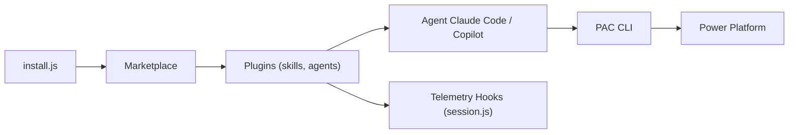

# microsoft/power-platform-skills

> Marketplace de plugins Claude Code / Copilot CLI pour générer des applications, sites et flux Power Platform.

## Le problème
Construire des apps Power Pages, Power Apps ou Power Automate à la main demande de jongler entre PAC CLI, schémas et déploiement.

## Ce que ça fait vraiment
Huit plugins (power-pages, model-apps, mcp-apps, code-apps, mobile-apps, power-apps-mobile-extension, canvas-apps, power-automate) fournissent des skills, agents et commandes. L'utilisateur décrit son intention en langage naturel, l'agent génère puis déploie via PAC CLI. Le support du code n'est visible que pour mobile, model-apps et Power Pages ; le reste est décrit par le README seul.

## Comment c'est branché


## Essayer
```bash
curl -fsSL https://raw.githubusercontent.com/microsoft/power-platform-skills/main/scripts/install.js | node
/plugin marketplace add microsoft/power-platform-skills
/plugin install power-pages@power-platform-skills
```

## Coût et pièges
Il faut un environnement Power Platform (licences non détaillées dans le README) et `pac` CLI ; canvas-apps demande .NET 10, power-automate Node 18+ et `az login`. La télémétrie de Power Pages est active par défaut (GUID d'organisation et de tenant, éventuellement l'ID Entra de l'utilisateur) ; désactivation via `/power-pages:telemetry off`.

## Ce que ce n'est pas
Pas un outil généraliste : tout est lié à l'écosystème Microsoft Power Platform. Le mode « sans interruption » du README donne à l'agent les mêmes accès que vous : à réserver aux environnements de confiance. 130 issues ouvertes.

## Alternatives
Aucune alternative citée dans le README.

## Pour toi
À ignorer sauf si ton équipe construit sur Power Platform : ce n'est ni de la donnée ni du MLOps, et la télémétrie par défaut est à connaître.
