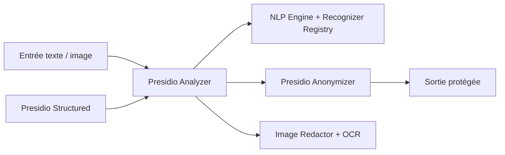

# microsoft/presidio

> SDK de détection et d'anonymisation de données personnelles dans le texte et les images.

## Le problème
Repérer et masquer les données personnelles (cartes, noms, numéros, portefeuilles) avant de partager ou d'entraîner sur un jeu de données.

## Ce que ça fait vraiment
Quatre composants : Analyzer (détection par reconnaisseurs NER, expressions régulières, règles, sommes de contrôle et contexte, en plusieurs langues), Anonymizer (opérateurs de remplacement, masque, hachage, chiffrement), Image Redactor (OCR, images standard et DICOM) et Structured (données tabulaires). Utilisable en Python, PySpark, Docker ou Kubernetes ; possibilité de brancher des modèles externes.

## Comment c'est branché

## Essayer
Le README ne donne pas de commande : il renvoie à « Using pip », « Using Docker » et « From source » dans la documentation.

## Coût et pièges
Gratuit. Le README avertit que la détection automatique n'est pas exhaustive : prévoir d'autres protections. Le README signale que le projet a déménagé vers data-privacy-stack/presidio.

## Ce que ce n'est pas
Pas une garantie de conformité (RGPD ou autre) : c'est un outil de détection probabiliste. Le dépôt indexé peut n'être plus le lieu de développement actif.

## Alternatives
Aucune alternative nommée dans le README.

## Pour toi
À adopter pour purger des données avant entraînement ou partage, en vérifiant où vit désormais le développement.
