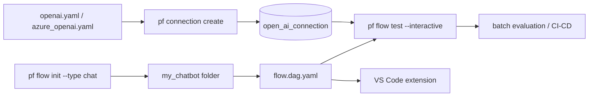

# microsoft/promptflow

> **One sentence.** A command-line suite to author, trace, evaluate and deploy LLM flows.

## The problem

Without tooling, an LLM application is built from throwaway scripts: the prompt, the model call
and the Python glue live apart, interactions with the model are not traced, and there is no way
to measure what a change does to quality beyond a handful of hand-checked examples.

## What it actually does

Prompt flow defines a *flow*: an executable graph described in a `flow.dag.yaml` file that
declares its inputs and outputs, its nodes, the connection in use and the LLM model. Around
that format, the package ships a `pf` CLI that scaffolds a flow from a template, creates and
stores connections (OpenAI or Azure OpenAI key), runs the flow interactively, and drives batch
runs with evaluation over a dataset. The README also lists tracing of LLM interactions, folding
testing and evaluation into a CI/CD system, and deploying a flow to a serving platform or into
an application's own code base. A VS Code extension acts as a flow designer with a UI.

## How it is wired



No code-derived diagram exists for this repository; the graph above reuses the files and
commands named in the README.

## Trying it

```sh
pip install promptflow promptflow-tools
pf flow init --flow ./my_chatbot --type chat
pf connection create --file ./my_chatbot/openai.yaml --set api_key=<your_api_key> --name open_ai_connection
pf flow test --flow ./my_chatbot --interactive
```

For Azure OpenAI, the README gives instead:

```sh
pf connection create --file ./my_chatbot/azure_openai.yaml --set api_key=<your_api_key> api_base=<your_api_base> --name open_ai_connection
```

## Cost and gotchas

The package is MIT licensed, but nothing runs without an OpenAI key or an Azure OpenAI
resource: the inference bill is yours, and the default template points at `gpt-35-turbo`. The
Python environment is constrained: `python>=3.9, <=3.11` is recommended. Telemetry collection
is on by default and goes to Microsoft; the README gives
`pf config set telemetry.enabled=false` to opt out. The cloud version in Azure AI is described
as optional but "highly recommended" for team work — that is the entry point to a paid service.

## What it is not

It is not an inference server or a model provider: Prompt flow orchestrates calls to models
hosted elsewhere. It is not a general ML experimentation platform either — the documented scope
is the LLM application lifecycle, not training. And multi-user collaboration and centralised
tracking are not in the local package: the README points those to Prompt flow in Azure AI.

## Alternatives

- **mlflow/mlflow**: pick it when the need is broad experiment tracking and a model registry
  rather than prompt orchestration and flow evaluation.
- **comet-ml/opik** and **JudgmentLabs/judgeval**: neighbours aimed at tracing and evaluating
  LLM applications, worth a look when evaluation matters more than an executable flow graph.

## Why it matters to you

Worth a look if you build LLM applications and want a versionable flow format plus a
test/evaluation loop in CI without starting from scratch. The caveat is the Azure pull: the
local CLI stands alone, but the documented path leads to the cloud edition. Watch rather than
adopt blindly.
