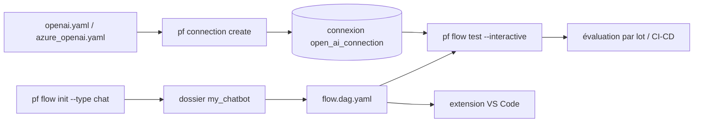

# microsoft/promptflow

> **Une phrase.** Suite d'outils en ligne de commande pour écrire, tracer, évaluer et déployer des flux LLM.

## Le problème

Sans outillage, une application LLM se développe en scripts jetables : le prompt, l'appel au
modèle et le bout de code Python qui les colle vivent séparément, on ne trace pas l'interaction
avec le modèle, et on n'a aucun moyen de mesurer la qualité d'une modification sur un jeu de
données plus large que trois exemples testés à la main.

## Ce que ça fait vraiment

Prompt flow définit un *flow* : un graphe exécutable décrit dans un fichier `flow.dag.yaml`,
qui déclare ses entrées/sorties, ses nœuds, la connexion utilisée et le modèle LLM. Autour de
ce format, le paquet fournit une CLI `pf` qui initialise un flow depuis un template, crée et
stocke les connexions (clé OpenAI ou Azure OpenAI), exécute le flow en mode interactif, et
lance des exécutions par lot avec évaluation sur un jeu de données. Le README annonce aussi le
traçage des interactions avec les LLM, l'intégration des tests et de l'évaluation dans une
chaîne CI/CD, et le déploiement du flow sur une plateforme de service ou dans le code d'une
application. Une extension VS Code sert de concepteur de flow avec interface graphique.

## Comment c'est branché



Aucun diagramme tiré du code n'existe pour ce dépôt ; ce graphe reprend les fichiers et
commandes nommés dans le README.

## Essayer

```sh
pip install promptflow promptflow-tools
pf flow init --flow ./my_chatbot --type chat
pf connection create --file ./my_chatbot/openai.yaml --set api_key=<your_api_key> --name open_ai_connection
pf flow test --flow ./my_chatbot --interactive
```

Pour Azure OpenAI, le README donne à la place :

```sh
pf connection create --file ./my_chatbot/azure_openai.yaml --set api_key=<your_api_key> api_base=<your_api_base> --name open_ai_connection
```

## Coût et pièges

Le paquet est sous licence MIT, mais rien ne tourne sans une clé OpenAI ou une ressource Azure
OpenAI : la facture d'inférence est à ta charge, et le template par défaut pointe sur
`gpt-35-turbo`. L'environnement Python est contraint : `python>=3.9, <=3.11` est recommandé.
La télémétrie est activée par défaut et s'envoie à Microsoft ; le README indique
`pf config set telemetry.enabled=false` pour la couper. La version cloud dans Azure AI est
présentée comme optionnelle mais « fortement recommandée » pour le travail en équipe — c'est
la porte d'entrée vers un service payant.

## Ce que ce n'est pas

Ce n'est pas un serveur d'inférence ni un fournisseur de modèles : Prompt flow orchestre des
appels vers des modèles hébergés ailleurs. Ce n'est pas non plus une plateforme
d'expérimentation ML généraliste — le périmètre documenté est le cycle de vie d'applications
LLM, pas l'entraînement. Enfin, la collaboration multi-utilisateurs et le suivi centralisé ne
sont pas dans le paquet local : le README les renvoie à Prompt flow dans Azure AI.

## Alternatives

- **mlflow/mlflow** : si le besoin est le suivi d'expériences et le registre de modèles au sens
  large plutôt que l'orchestration de prompts et l'évaluation de flows LLM.
- **comet-ml/opik** et **JudgmentLabs/judgeval** : voisins orientés traçage et évaluation
  d'applications LLM, à regarder si l'évaluation prime sur la définition d'un graphe exécutable.

## Pour toi

Intéressant si tu construis des applications LLM et que tu veux un format de flow versionnable
plus une boucle test/évaluation en CI, sans repartir de zéro. Le point de vigilance est
l'ancrage Azure : la CLI locale est utilisable seule, mais la trajectoire documentée mène vers
la version cloud. À surveiller plutôt qu'à adopter les yeux fermés.
