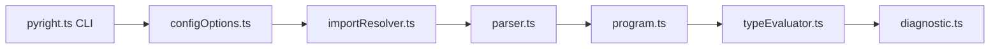

# microsoft/pyright

> Vérificateur de types statique pour Python, en ligne de commande et extension VS Code.

## Le problème
Les erreurs de type Python n'apparaissent qu'à l'exécution ; il faut un vérificateur rapide sur de gros dépôts.

## Ce que ça fait vraiment
Charge la configuration, résout les imports, analyse les sources, évalue les types et émet des diagnostics. Livré en CLI, extension VS Code (serveur de langage avec fonctions d'édition), avec un serveur de types et la prise en charge de notebooks. Benchmark hebdomadaire contre d'autres vérificateurs et un playground en ligne sont cités. Variable `PYRIGHT_TMPDIR` pour le dossier temporaire.

## Comment c'est branché


## Essayer
```bash
# Aucune commande d'installation dans le README fourni
# (renvoi vers la documentation) ; seule variable : PYRIGHT_TMPDIR=<dossier>.
```

## Coût et pièges
Gratuit. Licence présente mais non identifiée par GitHub : à vérifier dans le dépôt. Fait partie des outils lancés depuis Node.

## Ce que ce n'est pas
Pas un formateur ni un linter de style ; ne remplace pas les tests.

## Alternatives
Aucune alternative nommée dans le README (benchmark contre d'autres vérificateurs, non nommés ici).

## Pour toi
Très pertinent pour fiabiliser du code Python data/ML en CI et dans VS Code ; adopte après avoir confirmé la licence.

