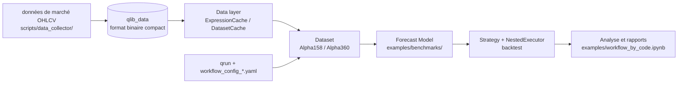

# microsoft/qlib

> **Une phrase.** Plateforme Python d'investissement quantitatif orientée IA, pour chercheurs quant et data scientists finance.

## Le problème

Sans elle, un chercheur quant réécrit à chaque fois le même tuyau : ingestion de données de marché
hétérogènes, construction de features, entraînement, backtest, analyse. Le README note que les
bases généralistes (MySQL, MongoDB, InfluxDB, HDF5) passent trop de temps à charger les données
à cause des couches d'interfaces et des conversions de format.

## Ce que ça fait vraiment

Qlib couvre la chaîne complète : traitement des données, entraînement de modèles, backtest,
puis alpha seeking, modélisation du risque, optimisation de portefeuille et exécution d'ordres.
Elle fournit un stockage de données dans un format compact propre, avec `ExpressionCache` et
`DatasetCache`. Elle embarque un zoo de modèles (XGBoost, LightGBM, CatBoost, MLP, LSTM, GRU,
ALSTM, GATs, SFM, TFT, TabNet, DoubleEnsemble, TCTS, Transformer, Localformer, TRA, TCN,
ADARNN, ADD, IGMTF, HIST, KRNN, Sandwich), deux jeux de features (`Alpha158`, `Alpha360`),
un volet adaptation aux dynamiques de marché (Rolling Retraining, DDG-DA) et un cadre
d'apprentissage par renforcement pour l'exécution d'ordres (TWAP, PPO, OPDS). Les composants
sont décrits comme des modules faiblement couplés, utilisables chacun seul.

## Comment c'est branché



Pas de diagramme tiré du code pour ce dépôt : ce schéma est reconstruit depuis le README.
Le pilotage passe soit par `qrun` et un fichier YAML de workflow, soit par un script
`workflow_by_code`. Le serveur de données a un mode `Offline` (défaut, local) et un mode
`Online` (service partagé, code dans microsoft/qlib-server).

## Essayer

```bash
pip install pyqlib
```

```bash
wget https://github.com/chenditc/investment_data/releases/latest/download/qlib_bin.tar.gz
mkdir -p ~/.qlib/qlib_data/cn_data
tar -zxvf qlib_bin.tar.gz -C ~/.qlib/qlib_data/cn_data --strip-components=1
rm -f qlib_bin.tar.gz
```

```bash
cd examples  # Avoid running program under the directory contains `qlib`
qrun benchmarks/LightGBM/workflow_config_lightgbm_Alpha158.yaml
```

## Coût et pièges

Gratuit, pas de clé d'API. Python 3.8 à 3.12, conda conseillé. Le piège principal est la
donnée : le README indique que « Due to more restrict data security policy. The official
dataset is disabled temporarily » et renvoie vers un jeu contribué par la communauté. Les
données officielles proviennent de Yahoo Finance et le README prévient qu'elles « might not
be perfect ». On ne peut pas mettre à jour incrémentalement le jeu offline fourni : il faut
repartir du yahoo collector. `run_all_model.py` ne tourne que sous Linux, chaque baseline a
ses propres dépendances (TFT exige Python 3.6~3.7 à cause de `tensorflow==1.15.0`), et le
changement de `group_key` entre pandas 1.5 et 2.0 casse plusieurs exemples listés nommément.
Une image Docker existe : `docker pull pyqlib/qlib_image_stable:stable`.

## Ce que ce n'est pas

Ce n'est pas un terminal de trading ni un broker : rien n'exécute d'ordre réel, la chaîne
s'arrête au backtest et à l'analyse. Ce n'est pas non plus un fournisseur de données — le jeu
officiel est désactivé et il faut apporter le sien. Ce n'est pas une fabrique de facteurs par
LLM : cette partie vit dans un dépôt séparé, RD-Agent. Et les chiffres de rendement affichés
dans le README sont la sortie d'un exemple, pas une promesse de performance.

## Alternatives

- **microsoft/RD-Agent**, cité par le README : pour la recherche de facteurs et l'optimisation
  de modèles pilotées par LLM, en complément et non en remplacement de Qlib.
- **microsoft/qlib-server**, cité par le README : à prendre si le besoin est un service de
  données partagé plutôt que le mode offline local.
- **firmai/financial-machine-learning** parmi les voisins : une liste de ressources ML finance,
  utile pour explorer le domaine, pas un cadre exécutable.

## Pour toi

Intéressant si le sujet est la finance quantitative : le pipeline complet, le zoo de modèles
et le format de données valent la lecture, même pour s'inspirer de l'architecture. Hors de ce
domaine, le socle est trop spécialisé. À surveiller plutôt qu'à adopter les yeux fermés : la
dernière version annoncée dans le README est v0.9.0 (déc. 2022) et le jeu de données officiel
est indisponible, donc l'entrée en matière dépend d'une source communautaire.
