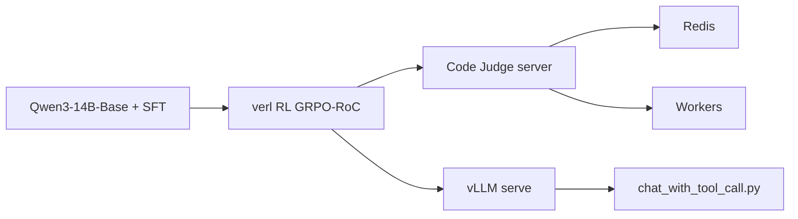

# microsoft/rStar

> Code de rStar2-Agent : RL agentique avec exécution de code pour un modèle de maths 14B.

## Le problème
Entraîner un modèle de raisonnement qui appelle des outils de code coûte cher en rollouts et en GPU. Le papier annonce une méthode plus économe.

## Ce que ça fait vraiment
Le README couvre trois choses : discuter avec le modèle via vLLM et un serveur Code Judge (Redis + workers qui exécutent le Python généré), évaluer sur AIME24/25 et MATH500, et lancer l'entraînement RL (GRPO-RoC) sur verl v0.5 avec Qwen3-14B-Base. Il précise que ce cadre migré n'a pas encore servi à entraîner un modèle complet (50 premiers pas vérifiés).

## Comment c'est branché


## Essayer
```bash
git submodule init && git submodule update
pip install "torch<2.8"
pip install -r verl/requirements_sglang.txt
pip install -e verl
pip install -r code-judge/requirements.txt && pip install -e code-judge
pip install -e .
vllm serve /path/to/your/model --host 0.0.0.0 --port 8000 --enable-auto-tool-choice --tool-call-parser hermes
MODEL_PATH=/path/to/your/model bash examples/aime_eval.sh
```

## Coût et pièges
Entraînement prévu pour 8 GPU A100/H100 ; le papier cite 64 MI300X. Code Judge exécute du code arbitraire : Docker et réseau isolé, jamais exposé. Le serveur Redis du README est lancé avec `--protected-mode no --bind 0.0.0.0`.

## Ce que ce n'est pas
Ce n'est pas un modèle prêt à télécharger ici, ni une reproduction validée de bout en bout. Le graphe d'architecture fourni décrit un pipeline MCTS (rStar-Math) qui ne correspond pas au README : les deux coexistent sans explication.

## Alternatives
Aucune alternative nommée ; le dépôt s'appuie sur verl et Code Judge.

## Pour toi
Surveiller : utile pour comprendre le RL agentique avec outils, mais le cadre publié n'est pas validé sur un entraînement complet.

