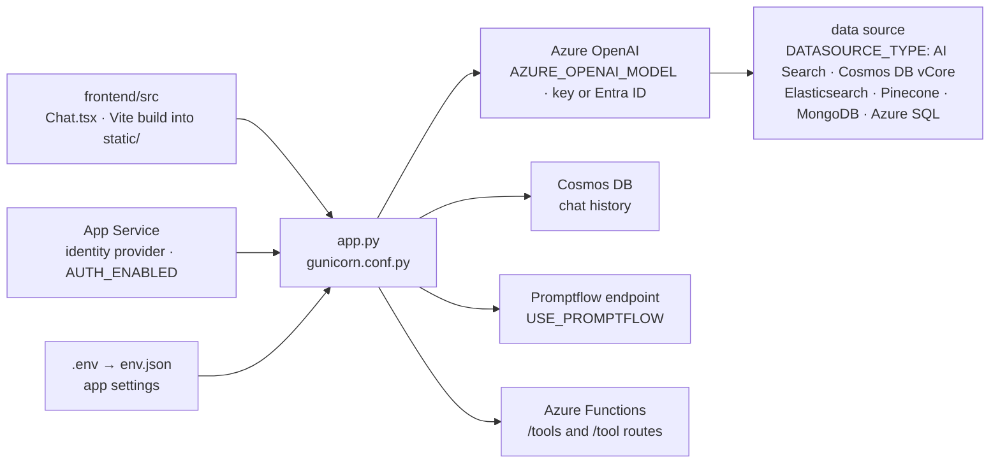

# microsoft/sample-app-aoai-chatGPT

> **A sample chat app to fork, wiring Azure OpenAI onto your own documents.**

## The problem

Putting a chat interface in front of Azure OpenAI "on your data" means hand-assembling App
Service authentication, the request contract of a still-preview API, a search index
configuration, conversation storage and a web frontend. Microsoft documents each piece on its
own; nothing tells you in which order to wire them, nor which environment variables have to
line up.

## What it actually does

The repo ships a chat webapp already wired together: a Python backend started with
`python3 -m gunicorn app:app`, and a frontend built from `frontend/src` (Vite, TypeScript, React
judging by `frontend/src/pages/chat/Chat.tsx`) whose output is copied into `static/`.

Most of the work happens through environment variables, starting from `.env.sample`: the README
documents several dozen of them, grouped per scenario. A basic chat mode only needs the Azure
OpenAI resource name and model deployment name. The "chat with your data" mode adds a
`DATASOURCE_TYPE` that picks the source: `AzureCognitiveSearch`, `AzureCosmosDB` (Mongo vCore),
`Elasticsearch` (preview), `Pinecone` and `MongoDB` (private preview), `AzureSqlServer` (private
preview). Each source gets its own settings block — content, title and vector columns, `TOP_K`,
`STRICTNESS`, `ENABLE_IN_DOMAIN`.

Three extensions are provided: chat history stored in a Cosmos DB account (`AZURE_COSMOSDB_*`),
calling an already-deployed Promptflow endpoint instead of the model directly (`USE_PROMPTFLOW`),
and function calling delegated to two Azure Functions routes, `/tools` and `/tool`, for which the
README gives sample code. Branding (title, logo, favicon, buttons) is set through the `UI_*`
variables.

## How it is wired



No code-derived diagram exists for this repo: this one is reconstructed from the README alone,
using the files it names. The thing to note is that the backend is mostly a router — Azure OpenAI
queries the data source, not `app.py`.

## Try it

```bash
cat .env | jq -R '. | capture("(?<name>[A-Z_]+)=(?<value>.*)")' | jq -s '.[].slotSetting=false' > env.json
```

Locally, the README says to copy `.env.sample` to `.env`, then run `start.cmd` (or `start.sh`),
which builds the frontend, installs backend dependencies and starts the app at
http://127.0.0.1:50505. To deploy:

```bash
az webapp up --runtime PYTHON:3.11 --sku B1 --name <new-app-name> --resource-group <resource-group-name> --location <azure-region> --subscription <subscription-name>
az webapp config set --startup-file "python3 -m gunicorn app:app" --name <new-app-name>
az webapp config appsettings set -g <resource-group-name> -n <existing-app-name> --settings WEBSITE_WEBDEPLOY_USE_SCM=false
az webapp config appsettings set -g <resource-group-name> -n <existing-app-name> --settings "@env.json"
```

The README also points to a one-click "Deploy to Azure" button, and an Azure Developer CLI path
deferred to `README_azd.md`, which is not part of the README read here.

## Cost and gotchas

- **Nothing runs without Azure.** You need an existing Azure OpenAI resource with a chat model
  deployment (`gpt-35-turbo-16k`, `gpt-4` per the README), hence a subscription and a bill of your
  own. Chat history adds a Cosmos DB account, retrieval an AI Search service, and every extension
  its own resource.
- **Authentication blocks by default**: without an identity provider added after deployment, the
  chat functionality is blocked. The `AUTH_ENABLED=False` workaround opens the app to anyone — the
  README explicitly advises against it.
- **Admin key**: `AZURE_SEARCH_KEY` expects an *admin key* for the AI Search service. The Entra ID
  alternative requires role assignments (`Search Index Data Reader`, `Search Service Contributor`,
  `Cognitive Services OpenAI User`) that take a few minutes to take effect.
- **Security telemetry on by default**: `MS_DEFENDER_ENABLED` defaults to `True` and is listed as
  required; it assumes the Defender for Cloud plan for AI workloads on the subscription.
- **Preview API**: the README warns that the code implements the contract of the most recent
  preview version of the Azure OpenAI API, and that you must merge updates from `main` regularly to
  keep up. Several data sources are themselves in public or private preview.
- **Build gotchas**: if the frontend changes, rerun `start.sh`/`start.cmd` and check that `static/`
  was updated before deploying, otherwise your changes are not picked up. Custom images
  (`UI_LOGO`, `UI_FAVICON`) go into `frontend/public` before the build and are referenced with a
  relative `static/<filename>` path.
- **Incompatible settings**: `AZURE_OPENAI_STREAM=True` prevents the use of Promptflow.
- Scaling: thread and worker counts live in `gunicorn.conf.py` and require a redeploy after a
  change.

## What it is not

- **It is not a product, nor a managed service.** The README is titled "Sample Chat App": the repo
  invites you to fork and edit `frontend/src` and `app.py`. There is no backward-compatibility
  promise and no automatic update — pulling `main` is on you.
- **It is not a RAG engine.** The app does not chunk, index or embed documents: it assumes an
  index already exists (AI Search, Cosmos DB vCore, Elasticsearch, Pinecone…) and Azure OpenAI "on
  your data" does the retrieval. The README defers index creation to the Azure documentation.
- **It is not portable off Azure.** Even the open pieces in the list (Elasticsearch, Pinecone,
  MongoDB) go through the Azure OpenAI contract; no documented path leads to another model
  provider.
- **It is not secure out of the box in the usual sense**: authentication is configured afterwards
  in the App Service portal, not in the code.

## Alternatives

No comparable alternative in the catalogue. The README names no competing project, and the
suggested neighbours belong to other trades: `pingcap/tidb` is a distributed database,
`SYSTRAN/faster-whisper` does audio transcription, `getzep/graphiti` and `vanna-ai/vanna` cover
graph memory and text-to-SQL respectively — none of them ships a deployable chat app on Azure
OpenAI.

## For you

Genuinely useful if Azure is the target: it is the shortest path from an Azure OpenAI resource to
a document-chat demo you can show a business stakeholder, with history, citations and
authentication already wired. Worth watching rather than adopting as a foundation: the code is a
fork-me sample, the cost of staying in sync with `main` is yours, and everything that makes a good
RAG (chunking, indexing, evaluation) stays outside the repo. Off Azure, it does not apply.
