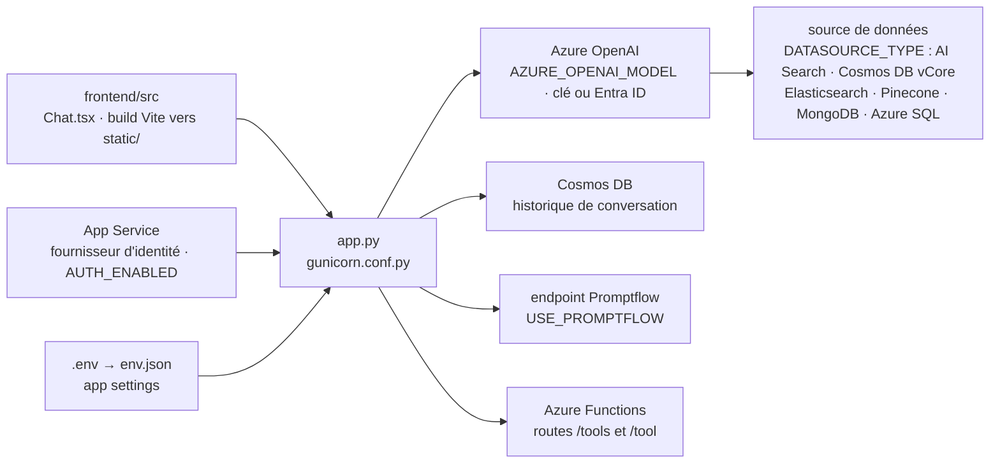

# microsoft/sample-app-aoai-chatGPT

> **Application de chat d'exemple à forker, pour brancher Azure OpenAI sur ses propres documents.**

## Le problème

Mettre une interface de chat devant Azure OpenAI « sur vos données » demande de recoller à la
main l'authentification App Service, le contrat de requête d'une API encore en préversion, la
configuration d'un index de recherche, le stockage de l'historique et un front web. Chacun de
ces morceaux est documenté isolément chez Microsoft ; rien ne dit dans quel ordre les câbler ni
quelles variables d'environnement doivent coïncider.

## Ce que ça fait vraiment

Le dépôt livre le code d'une webapp de chat déjà câblée : un backend Python lancé par
`python3 -m gunicorn app:app` et un frontend construit depuis `frontend/src` (Vite, TypeScript,
React d'après `frontend/src/pages/chat/Chat.tsx`) dont la sortie est copiée dans `static/`.

L'essentiel du travail se fait par variables d'environnement, à partir de `.env.sample` : le
README en documente plusieurs dizaines, groupées par scénario. Un mode « chat simple » ne
demande que le nom de la ressource et du déploiement de modèle Azure OpenAI. Le mode « chat with
your data » ajoute un `DATASOURCE_TYPE` qui choisit la source : `AzureCognitiveSearch`,
`AzureCosmosDB` (Mongo vCore), `Elasticsearch` (préversion), `Pinecone` et `MongoDB` (préversion
privée), `AzureSqlServer` (préversion privée). Chaque source a son propre bloc de réglages —
colonnes de contenu, de titre, de vecteurs, `TOP_K`, `STRICTNESS`, `ENABLE_IN_DOMAIN`.

Trois extensions sont prévues : l'historique de conversation stocké dans un compte Cosmos DB
(`AZURE_COSMOSDB_*`), l'appel d'un endpoint Promptflow déjà déployé à la place de l'appel direct
(`USE_PROMPTFLOW`), et l'appel de fonctions délégué à deux routes Azure Functions `/tools` et
`/tool` dont le README donne le code d'exemple. L'habillage (titre, logo, favicon, boutons) se
règle par les variables `UI_*`.

## Comment c'est branché



Aucun diagramme tiré du code n'existe pour ce dépôt : ce schéma est reconstruit depuis le seul
README, à partir des fichiers qu'il nomme. Le point à retenir est que le backend n'est qu'un
aiguillage : c'est Azure OpenAI qui interroge la source de données, pas `app.py`.

## Essayer

```bash
cat .env | jq -R '. | capture("(?<name>[A-Z_]+)=(?<value>.*)")' | jq -s '.[].slotSetting=false' > env.json
```

En local, le README demande de copier `.env.sample` en `.env`, puis de lancer `start.cmd` (ou
`start.sh`), qui construit le frontend, installe les dépendances du backend et démarre l'app sur
http://127.0.0.1:50505. Pour déployer :

```bash
az webapp up --runtime PYTHON:3.11 --sku B1 --name <new-app-name> --resource-group <resource-group-name> --location <azure-region> --subscription <subscription-name>
az webapp config set --startup-file "python3 -m gunicorn app:app" --name <new-app-name>
az webapp config appsettings set -g <resource-group-name> -n <existing-app-name> --settings WEBSITE_WEBDEPLOY_USE_SCM=false
az webapp config appsettings set -g <resource-group-name> -n <existing-app-name> --settings "@env.json"
```

Le README signale aussi un bouton « Deploy to Azure » en un clic, et un chemin Azure Developer
CLI renvoyé vers `README_azd.md`, qui n'est pas dans le README lu.

## Coût et pièges

- **Rien ne tourne sans Azure.** Il faut une ressource Azure OpenAI existante avec un déploiement
  de modèle de chat (`gpt-35-turbo-16k`, `gpt-4` d'après le README), donc un abonnement et une
  facture à ta charge. L'historique ajoute un compte Cosmos DB, la recherche un service AI Search,
  et chaque extension sa propre ressource.
- **L'authentification est bloquante par défaut** : sans fournisseur d'identité ajouté après
  déploiement, la fonction de chat est bloquée. Le contournement `AUTH_ENABLED=False` ouvre l'app
  à tout le monde — le README le déconseille explicitement.
- **Clé admin** : `AZURE_SEARCH_KEY` attend une *admin key* du service AI Search. L'alternative
  Entra ID demande des attributions de rôles (`Search Index Data Reader`, `Search Service
  Contributor`, `Cognitive Services OpenAI User`) qui mettent quelques minutes à prendre effet.
- **Télémétrie de sécurité activée par défaut** : `MS_DEFENDER_ENABLED` vaut `True` et est marquée
  requise, elle suppose le plan Defender for Cloud pour charges IA sur l'abonnement.
- **API en préversion** : le README prévient que le code implémente le contrat de la dernière
  version de préversion de l'API Azure OpenAI, et qu'il faut fusionner régulièrement les mises à
  jour depuis `main` pour ne pas décrocher. Plusieurs sources de données sont elles-mêmes en
  préversion publique ou privée.
- **Pièges de build** : si le frontend change, il faut relancer `start.sh`/`start.cmd` et vérifier
  que `static/` a bien été mis à jour avant de déployer, sinon les modifications ne partent pas.
  Les images personnalisées (`UI_LOGO`, `UI_FAVICON`) doivent être posées dans `frontend/public`
  avant build et référencées en chemin relatif `static/<fichier>`.
- **Réglages incompatibles** : `AZURE_OPENAI_STREAM=True` empêche l'usage de Promptflow.
- Montée en charge : nombre de threads et de workers dans `gunicorn.conf.py`, à redéployer après
  changement.

## Ce que ce n'est pas

- **Ce n'est pas un produit, ni un service géré.** Le titre du README est « Sample Chat App » : le
  dépôt invite à forker et à modifier `frontend/src` et `app.py`. Il n'y a ni promesse de
  compatibilité ascendante ni mise à jour automatique — c'est à toi de tirer `main` régulièrement.
- **Ce n'est pas un moteur de RAG.** L'application ne découpe pas, n'indexe pas et ne vectorise
  pas les documents : elle suppose un index déjà construit (AI Search, Cosmos DB vCore,
  Elasticsearch, Pinecone…) et c'est Azure OpenAI « on your data » qui fait la recherche. Le
  README renvoie à la documentation Azure pour créer l'index.
- **Ce n'est pas portable hors Azure.** Même les briques ouvertes de la liste (Elasticsearch,
  Pinecone, MongoDB) passent par le contrat Azure OpenAI ; il n'y a aucun chemin documenté vers un
  autre fournisseur de modèle.
- **Ce n'est pas sécurisé par défaut au sens où on l'entendrait** : l'authentification se configure
  après coup dans le portail App Service, elle n'est pas dans le code.

## Alternatives

Aucune alternative comparable dans le catalogue. Le README ne nomme aucun projet concurrent, et
les voisins proposés relèvent d'autres métiers : `pingcap/tidb` est une base de données
distribuée, `SYSTRAN/faster-whisper` de la transcription audio, `getzep/graphiti` et
`vanna-ai/vanna` touchent respectivement à la mémoire de graphe et au texte-vers-SQL — aucun ne
livre une application de chat prête à déployer sur Azure OpenAI.

## Pour toi

Intérêt réel si la cible est Azure : c'est le chemin le plus court entre une ressource Azure
OpenAI et une démo de chat sur documents montrable à un métier, avec l'historique, les citations
et l'authentification déjà câblés. À surveiller plutôt qu'à adopter comme socle : le code est un
exemple à forker, la dette de synchronisation avec `main` te revient, et tout ce qui fait la
qualité d'un RAG (découpage, indexation, évaluation) reste hors du dépôt. Hors Azure, sans objet.
