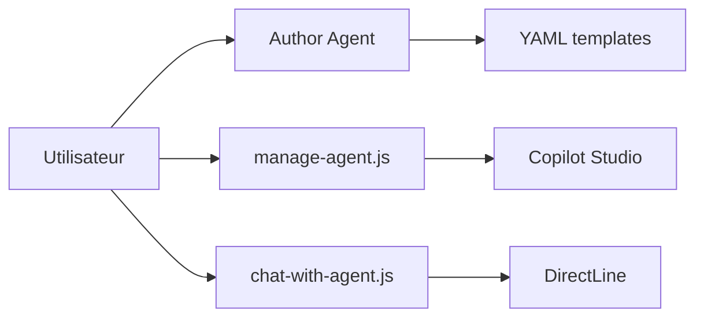

# microsoft/skills-for-copilot-studio

> Plugin Claude Code, Copilot CLI et VS Code pour écrire et tester des agents Copilot Studio en YAML.

## Le problème
Construire des agents Microsoft Copilot Studio dans l'interface web est lent à versionner et à tester.

## Ce que ça fait vraiment
Quatre sous-agents : manage (clone, push, pull), author (YAML de topics, actions, connaissances), test (tests ponctuels, suites, évaluation) et advisor (revue et conseils). Des scripts Node gèrent la synchronisation, le chat DirectLine avec l'agent publié, l'API d'évaluation, l'authentification MSAL.

## Comment c'est branché


## Essayer
```bash
/plugin marketplace add microsoft/skills-for-copilot-studio
/plugin install copilot-studio@skills-for-copilot-studio
/copilot-studio:copilot-studio-manage clone
```

## Coût et pièges
Exige un environnement Copilot Studio, l'extension VS Code et une connexion Microsoft. La publication se fait dans l'interface Copilot Studio.

## Ce que ce n'est pas
Le README précise : projet de recherche expérimental, non officiel ; le schéma YAML peut changer ; ne couvre que les agents STANDARD.

## Alternatives
- New Microsoft Copilot Studio Plugin : pour les agents du harnais GitHub Copilot.

## Pour toi
À ignorer sauf si ton organisation construit sur Copilot Studio : lié à un SaaS Microsoft et sans valeur hors de lui.

