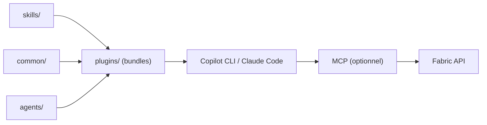

# microsoft/skills-for-fabric

> Skills et agents Markdown qui apprennent à Copilot CLI et autres assistants de code à travailler avec Microsoft Fabric.

## Le problème
Un assistant de code connaît mal les API, requêtes et bonnes pratiques de Fabric (Spark, SQL DW, KQL, Power BI).

## Ce que ça fait vraiment
Dépôt de contenu : skills, guidances communes et 5 agents (ingénieur data, admin, migration…) packagés en bundles `fabric-skills` et `powerbi-authoring`. Couvre entrepôt SQL, Spark/Lakehouse, modèles sémantiques, Eventhouse/KQL, Eventstreams, Dataflows Gen2, migrations et médaillon. Des serveurs MCP optionnels donnent l'accès live.

## Comment c'est branché


## Essayer
```bash
/plugin marketplace add microsoft/skills-for-fabric
/plugin install fabric-skills@fabric-collection
az login
```

## Coût et pièges
Il faut un tenant Fabric et une authentification Azure (`az login`). Un bundle s'installe en entier ; APM (`apm install ... --skill`) permet d'en activer un seul, mais enregistre tous les MCP.

## Ce que ce n'est pas
Pas un outil qui exécute quoi que ce soit : des instructions. Inutile sans licence Fabric.

## Alternatives
Le README ne cite aucune alternative.

## Pour toi
À surveiller : pertinent si ton équipe data est sur Fabric ; sinon rien à en tirer.
