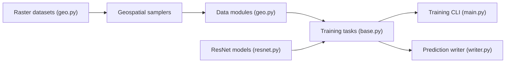

# microsoft/torchgeo

> Bibliothèque PyTorch de jeux de données, échantillonneurs et modèles pour l'apprentissage sur données géospatiales.

## Le problème
Imagerie satellite multispectrale, projections différentes et très grandes images rendent le chargement de données pour l'apprentissage laborieux.

## Ce que ça fait vraiment
Fournit des jeux géospatiaux (Landsat, CDL…) combinables par union (`|`) et intersection (`&`) avec reprojection automatique, des échantillonneurs de patchs, des jeux de référence (VHR10, BigEarthNet, Chesapeake…) téléchargeables avec somme de contrôle, des poids préentraînés multispectraux et des modules Lightning (datamodules, tâches de classification, segmentation, MoCo, BYOL). Une CLI `torchgeo` pilote entraînement et validation par fichier de config YAML.

## Comment c'est branché


## Essayer
```bash
pip install torchgeo
torchgeo fit --config config.yaml
torchgeo validate --config config.yaml --ckpt_path=...
torchgeo test --config config.yaml --ckpt_path=...
```

## Coût et pièges
Gratuit. Les images satellites sont volumineuses (stockage, éventuellement GPU) ; certains jeux se téléchargent automatiquement.

## Ce que ce n'est pas
Pas un service de données : il faut obtenir les images Landsat ou autres soi-même, sauf les jeux téléchargeables. Pas un outil SIG complet.

## Alternatives
- torchvision (cité comme point de comparaison) : sans le géospatial.
- timm : utilisé avec les poids dans l'exemple.

## Pour toi
À adopter dès que tu touches à l'observation de la Terre : API proche de torchvision, intégration Lightning, publication Microsoft active.

