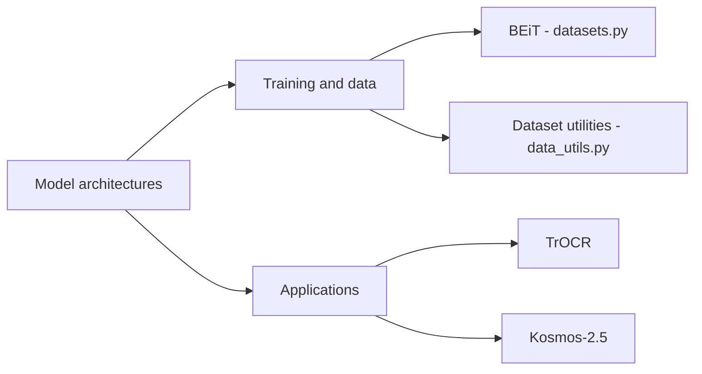

# microsoft/unilm

> Portefeuille de recherche Microsoft sur les modèles de fondation : LayoutLM, BEiT, WavLM, Kosmos, TrOCR et autres.

## Le problème
Accéder au code et aux poids de nombreux travaux de pré-entraînement (texte, vision, parole, document) dispersés dans des articles.

## Ce que ça fait vraiment
Ce n'est pas une application unique : le README présente architectures (TorchScale, DeepNet, RetNet, BitNet, LongNet), modèles (UniLM, MiniLM, LayoutLM v1 à v3, BEiT 1 à 3, WavLM, VALL-E, Kosmos), kits et applications (TrOCR, LayoutReader). Le code échantillonné montre notamment les jeux de données BEiT et le chargement multilingue Fairseq.

## Comment c'est branché

## Essayer
Aucune commande documentée dans le README : chaque sous-projet a sa propre documentation.

## Coût et pièges
Gratuit ; GPU nécessaire pour la plupart. Hétérogène : environnements et dépendances différents par sous-dossier. Les mentions de sorties s'arrêtent à 2022 dans le README.

## Ce que ce n'est pas
Pas une bibliothèque installable avec API unifiée. Certains modèles sont aussi disponibles ailleurs.

## Alternatives
- TorchScale : bibliothèque d'architectures de fondation (dépôt lié).

## Pour toi
À surveiller : mine de références, notamment LayoutLM et TrOCR pour l'extraction de documents, mais il faut aller au sous-projet voulu.

