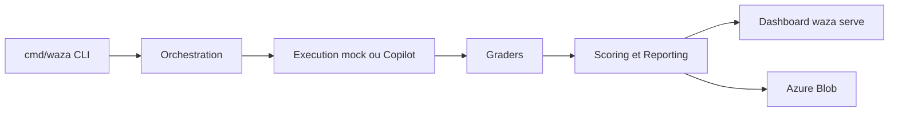

# microsoft/waza

> CLI Go pour évaluer des skills d'agents IA : suites d'évaluation, benchmarks et comparaison entre modèles.

## Le problème
Un skill (`SKILL.md`) se déclenche mal ou dégrade la réponse sans qu'on le voie, faute de tests reproductibles.

## Ce que ça fait vraiment
Génère squelettes de skills et d'évaluations, lance des tâches sur un moteur `mock` ou Copilot SDK, applique des graders (texte, fichier, diff, comportement, séquence d'actions, LLM juge), compare les modèles, rejoue des snapshots, fait des tests adversariaux (injection de prompt), mesure les jetons. Un tableau de bord (`waza serve`) affiche les résultats ; envoi possible vers Azure Blob.

## Comment c'est branché


## Essayer
```bash
curl -fsSL https://raw.githubusercontent.com/microsoft/waza/main/install.sh | bash
waza init my-project && cd my-project
waza new skill my-skill
waza run my-skill
waza check my-skill
waza compare results-gpt4.json results-sonnet.json
```

## Coût et pièges
Le moteur par défaut demande une authentification Copilot (`GITHUB_TOKEN` en CI) ou un fournisseur configuré par variables `COPILOT_*` ; le mode `mock` n'a pas besoin de clé. Le CLI vérifie les mises à jour en arrière-plan (coupable par `WAZA_NO_UPDATE_CHECK=1`). Compilation depuis les sources : Go 1.26 et Git LFS.

## Ce que ce n'est pas
Ce n'est pas un benchmark de modèles généraliste : il teste des skills et agents. La recherche de graders dans le registre renvoie encore des exemples fournis avec l'outil.

## Alternatives
Aucune alternative nommée dans le README.

## Pour toi
Adopter : si tu écris des skills d'agent, le mode `mock` et le code de sortie pour la CI permettent de les tester sans clé.

