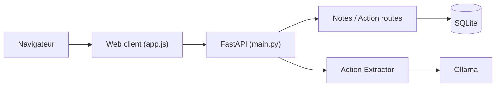

# mihail911/modern-software-dev-assignments

> Devoirs du cours Stanford CS146S sur le développeur moderne, pour étudiants.

## Le problème
Apprendre les pratiques modernes (prompting, RAG, outils d'IA) avec des exercices concrets.

## Ce que ça fait vraiment
Le README ne décrit que l'installation. D'après le code : exercices de prompting (chaîné, k-shot, auto-cohérence, Reflexion, appel d'outils), un exécuteur RAG avec Ollama, et une application FastAPI de notes et d'actions sur SQLite avec client web.

## Comment c'est branché


## Essayer
```bash
conda create -n cs146s python=3.12 -y
conda activate cs146s
curl -sSL https://install.python-poetry.org | python -
poetry install --no-interaction
```

## Coût et pièges
Gratuit ; Anaconda et Poetry requis ; un modèle Ollama local pour la partie RAG. Aucune licence : réutilisation juridiquement incertaine.

## Ce que ce n'est pas
Pas un produit ni une bibliothèque. README court (sous 800 caractères) : fiche minimale, plusieurs copies hebdomadaires du code.

## Alternatives
- Aucune alternative citée dans le README.

## Pour toi
À surveiller : matériel d'auto-formation utile sur le prompting et les outils d'IA, mais sans licence ni documentation.

