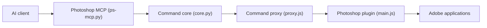

# mikechambers/adb-mcp

> Preuve de concept qui laisse une IA piloter Photoshop, Premiere, InDesign, After Effects et Illustrator via MCP.

## Le problème
Automatiser les applications Adobe par IA demande un pont entre un client MCP et des plugins qui ne peuvent pas écouter sur un socket.

## Ce que ça fait vraiment
Un serveur MCP Python par application expose des outils ; un proxy Node relaie par WebSocket vers des plugins UXP (Photoshop, Premiere, InDesign) ou CEP (After Effects, Illustrator) qui exécutent les commandes. Photoshop est le plus complet ; After Effects et Illustrator acceptent du ExtendScript arbitraire.

## Comment c'est branché


## Essayer
```bash
uv run mcp install --with fonttools --with python-socketio --with mcp --with requests --with websocket-client --with numpy ps-mcp.py
node proxy.js
```

## Coût et pièges
Gratuit, mais exige des licences Adobe (Photoshop 26+, Premiere Beta) et l'outil UXP Developer. Il faut recharger le plugin à chaque redémarrage. Non soutenu par Adobe.

## Ce que ce n'est pas
Pas un produit : le README parle de preuve de concept. L'IA se trompe sur le placement du texte et couvre seulement un sous-ensemble des fonctions.

## Alternatives
Aucune alternative nommée dans le README (media-utils-mcp est cité en complément pour Premiere).

## Pour toi
À ignorer : réservé à qui est déjà dans l'écosystème Adobe créatif ; peu de valeur pour un travail data/MLOps.

