# mikefarah/yq

> **A single binary that reads and edits YAML, JSON, XML, INI and CSV from the command line.**

## The problem

Changing one key in a `values.yaml`, a Kubernetes manifest or a `docker-compose.yml` from a
script otherwise means three lines of Python with `pyyaml`, or `sed` hacks that break as soon
as indentation shifts. And `jq`, the reflex tool for this kind of work, only speaks JSON: you
convert in and back out, losing comments on the way.

## What it actually does

`yq` applies a `jq`-style expression to a YAML document and writes it to standard output, or
with `-i` rewrites the file in place. The README claims partial `jq` coverage: the most common
operations and functions, with more added over time.

What it buys over a JSON round trip is preservation: the README states that YAML formatting and
comments are kept when updating — with the caveat, written in plain words, that there are
"issues with whitespace". On top of that: multi-document files, front matter blocks, anchors and
aliases, tags, styling, colorized output.

The tool's second job is conversion: `-p` picks the input format, `-o` the output one, among
yaml, json, kyaml, xml, toml, hcl, ini, lua, properties, csv, tsv, base64, uri, shell. Input
format is auto-detected from the extension, defaulting to YAML. Two evaluation modes coexist:
`eval` (the default, document by document) and `eval-all` / `ea` (all documents of all files
loaded at once), the latter being required to merge. Two flags,
`--security-disable-env-ops` and `--security-disable-file-ops`, switch off the operators that
read the environment or the disk.

## How it is wired

```mermaid
graph LR
  A[fichier ou STDIN<br/>yaml · json · xml · ini · csv · toml · hcl] --> B[décodeur<br/>-p / --input-format · auto-détection]
  B --> C[évaluateur d'expression<br/>eval par défaut · eval-all / ea]
  D[expression jq-like<br/>argument · --from-file · strenv NAME] --> C
  E[load&#40;&quot;autre.yaml&quot;&#41;<br/>--security-disable-file-ops] --> C
  C --> F[encodeur<br/>-o / --output-format · -P · -I indent]
  F --> G[STDOUT coloré]
  F --> H[réécriture sur place<br/>-i / --inplace]
  F --> I[fichiers découpés<br/>-s / --split-exp]
```



No code-derived diagram exists for this repository: the sketch is rebuilt from the README
alone, from the flags and commands it documents. The thing to keep is the decoder / encoder
symmetry around a single evaluator: that is what makes format conversion just a special case of
evaluation, with the identity expression.

## Trying it

```bash
brew install yq
```

Or the binary, with no package manager:

```bash
wget https://github.com/mikefarah/yq/releases/latest/download/yq_linux_amd64 -O /usr/local/bin/yq &&\
    chmod +x /usr/local/bin/yq
```

Then the basic operations, exactly as the README gives them:

```bash
yq '.a.b[0].c' file.yaml

yq -i '.a.b[0].c = "cool"' file.yaml

NAME=mike yq -i '.a.b[0].c = strenv(NAME)' file.yaml

# Convert JSON to YAML (pretty print)
yq -Poy sample.json

# Convert YAML to JSON
yq -o json file.yaml

# merge two files
yq -n 'load("file1.yaml") * load("file2.yaml")'
```

Installing nothing, via a container:

```bash
docker run --rm -v "${PWD}":/workdir mikefarah/yq '.a.b[0].c' file.yaml
```

## Cost and traps

- **Free, dependency-free, no account.** Written in Go, shipped as a static binary; the README
  also lists Homebrew, snap, nix, webi, pacman (`go-yq`), choco, scoop, winget, MacPorts, apk
  (`yq-go` from Alpine 3.20), flox, gah, and `go install`.
- **Dangerous name collision**: on Alpine 3.20+ the package is `yq-go`, on Arch `go-yq`, on nix
  `yq-go`. Installing plain `yq` may hand you a different tool.
- **Snap is strictly confined**: no direct access to root-owned files. The README requires
  `sudo cat /etc/myfile | yq '.a.path'`, and for writing, `sponge` or a temporary file.
- **The Docker image runs as non-root and carries no timezone data**: you need a derived
  `Dockerfile` with `apk add --no-cache tzdata` to use the `tz` operator, and `USER root` to
  install anything. Under podman with SELinux, the mount needs the `:z` flag.
- **Community packages may lag** behind official releases; the README says so, and notes the
  Debian package is no longer maintained.
- **Quoting under Windows PowerShell** is a documented trap with its own page.
- **An announced behaviour change**: `--yaml-fix-merge-anchor-to-spec` will default to `true`
  in "late 2025", changing how merge anchors resolve.

## What it is not

- **It is not `jq`, nor a full replacement.** The README says it: "It doesn't yet support
  everything `jq` does". An elaborate `jq` expression may not go through.
- **It is not kislyuk's `yq`** (the Python wrapper around `jq`). Same command name, different
  syntax and packaging — hence the `yq-go` / `go-yq` package names.
- **It is not a validator or a schema editor**: no notion of schema, JSON Schema or Kubernetes
  types. It manipulates trees, it does not check them.
- **It is not a faithful formatter**: comment and whitespace preservation is announced as
  imperfect, and points to the limits of `go-yaml/yaml` v3. The values "yes" and "no" are no
  longer booleans, `yq` following YAML 1.2.
- **It is not a library**: the README documents only command-line use, the GitHub Action and
  the container.

## Alternatives

| | When to prefer it |
|---|---|
| **stedolan/jq** | Named in the README as the source of the syntax. Prefer it when the data is already JSON and the expression is complex: coverage there is complete, whereas `yq` implements only part of it. |

The other neighbours supplied by the catalogue (`GoogleCloudPlatform/terraformer`,
`gruntwork-io/terragrunt`, `wagoodman/dive`, `go-shiori/shiori`) are not comparable: they are
respectively a Terraform code generator from existing infrastructure, a Terraform wrapper, a
Docker image layer explorer and a bookmark manager — none is a command-line processor of
structured documents.

## For you

Useful as soon as a pipeline touches YAML: patching a Kubernetes manifest or a Helm
`values.yaml` in a CI job, pulling a parameter out of a training configuration file, forcing an
image tag before deployment. A dependency-free binary that drops into a CI image in one line and
replaces an ad hoc Python script, with the GitHub Action provided for the most common case. The
habit to keep: spell out `yq-go` / `go-yq` when installing, and do not count on perfect comment
fidelity when rewriting in place.
