# mikefarah/yq

> **Un binaire unique qui lit et modifie YAML, JSON, XML, INI et CSV en ligne de commande.**

## Le problème

Modifier une clé dans un `values.yaml`, un manifeste Kubernetes ou un `docker-compose.yml`
depuis un script demande sinon d'écrire trois lignes de Python avec `pyyaml`, ou de bricoler
du `sed` qui casse dès que l'indentation change. Et `jq`, l'outil réflexe pour ce genre de
manipulation, ne parle que JSON : il faut convertir à l'aller et au retour, en perdant les
commentaires au passage.

## Ce que ça fait vraiment

`yq` applique une expression de type `jq` à un document YAML et l'écrit sur la sortie standard
ou, avec `-i`, réécrit le fichier sur place. Le README revendique une couverture partielle de
`jq` : les opérations et fonctions les plus courantes, complétées au fil du temps.

L'intérêt par rapport à une conversion JSON aller-retour est la préservation : le README
annonce que le formatage et les commentaires YAML sont conservés lors d'une mise à jour — avec
la réserve, écrite noir sur blanc, qu'il y a « des problèmes avec les espaces ». S'y ajoutent
les documents multiples, les blocs de front matter, les ancres et alias, les tags, le style,
la coloration en sortie.

Le deuxième métier de l'outil est la conversion : `-p` choisit le format d'entrée, `-o` celui
de sortie, parmi yaml, json, kyaml, xml, toml, hcl, ini, lua, properties, csv, tsv, base64,
uri, shell. Le format d'entrée est auto-détecté à l'extension, YAML par défaut. Deux modes
d'évaluation cohabitent : `eval` (défaut, document par document) et `eval-all` / `ea` (tous les
documents de tous les fichiers chargés d'un coup), ce dernier nécessaire pour fusionner.
Deux drapeaux `--security-disable-env-ops` et `--security-disable-file-ops` coupent les
opérations qui lisent l'environnement ou le disque.

## Comment c'est branché

```mermaid
graph LR
  A[fichier ou STDIN<br/>yaml · json · xml · ini · csv · toml · hcl] --> B[décodeur<br/>-p / --input-format · auto-détection]
  B --> C[évaluateur d'expression<br/>eval par défaut · eval-all / ea]
  D[expression jq-like<br/>argument · --from-file · strenv NAME] --> C
  E[load&#40;&quot;autre.yaml&quot;&#41;<br/>--security-disable-file-ops] --> C
  C --> F[encodeur<br/>-o / --output-format · -P · -I indent]
  F --> G[STDOUT coloré]
  F --> H[réécriture sur place<br/>-i / --inplace]
  F --> I[fichiers découpés<br/>-s / --split-exp]
```



Aucun diagramme tiré du code n'existe pour ce dépôt : ce schéma est reconstruit depuis le seul
README, à partir des drapeaux et commandes qu'il documente. Le point à retenir est la symétrie
décodeur / encodeur autour d'un unique évaluateur : c'est elle qui fait que la conversion entre
formats n'est qu'un cas particulier de l'évaluation, avec l'expression identité.

## Essayer

```bash
brew install yq
```

Ou le binaire, sans gestionnaire de paquets :

```bash
wget https://github.com/mikefarah/yq/releases/latest/download/yq_linux_amd64 -O /usr/local/bin/yq &&\
    chmod +x /usr/local/bin/yq
```

Puis les opérations de base, telles que données par le README :

```bash
yq '.a.b[0].c' file.yaml

yq -i '.a.b[0].c = "cool"' file.yaml

NAME=mike yq -i '.a.b[0].c = strenv(NAME)' file.yaml

# Convert JSON to YAML (pretty print)
yq -Poy sample.json

# Convert YAML to JSON
yq -o json file.yaml

# merge two files
yq -n 'load("file1.yaml") * load("file2.yaml")'
```

Sans rien installer, via conteneur :

```bash
docker run --rm -v "${PWD}":/workdir mikefarah/yq '.a.b[0].c' file.yaml
```

## Coût et pièges

- **Gratuit, sans dépendance, sans compte.** Écrit en Go, distribué en binaire statique ; le
  README liste aussi Homebrew, snap, nix, webi, pacman (`go-yq`), choco, scoop, winget,
  MacPorts, apk (`yq-go` depuis Alpine 3.20), flox, gah, et `go install`.
- **Homonymie dangereuse** : sur Alpine ≥ 3.20 le paquet s'appelle `yq-go`, sur Arch `go-yq`,
  sur nix `yq-go`. Installer `yq` sans préciser peut livrer un autre outil que celui-ci.
- **Snap en confinement strict** : pas d'accès aux fichiers de root. Le README impose de passer
  par `sudo cat /etc/myfile | yq '.a.path'`, et pour écrire par `sponge` ou un fichier
  temporaire.
- **Image Docker sans root et sans données de fuseau horaire** : il faut un `Dockerfile`
  dérivé avec `apk add --no-cache tzdata` pour utiliser l'opérateur `tz`, et `USER root` pour
  installer quoi que ce soit. Sous podman avec SELinux, le montage exige le drapeau `:z`.
- **Les paquets communautaires peuvent être en retard** sur les versions officielles ; le
  README le dit et signale que le paquet Debian n'est plus maintenu.
- **La citation sous Windows PowerShell** est un piège documenté à part, avec une page dédiée.
- **Changement de comportement annoncé** : `--yaml-fix-merge-anchor-to-spec` passera à `true`
  par défaut « fin 2025 », ce qui modifiera la résolution des ancres de fusion.

## Ce que ce n'est pas

- **Ce n'est pas `jq`, ni un remplacement complet.** Le README le précise : « It doesn't yet
  support everything `jq` does ». Une expression `jq` élaborée peut ne pas passer.
- **Ce n'est pas le `yq` de kislyuk** (le wrapper Python autour de `jq`). Même nom de commande,
  syntaxe et empaquetage différents — d'où les noms de paquets `yq-go` / `go-yq`.
- **Ce n'est pas un validateur ni un éditeur de schéma** : aucune notion de schéma, de JSON
  Schema ou de types Kubernetes. Il manipule des arbres, il ne les vérifie pas.
- **Ce n'est pas un formateur fidèle** : la préservation des commentaires et des espaces est
  annoncée comme imparfaite, et renvoie aux limites de `go-yaml/yaml` v3. Les valeurs « yes » et
  « no » ne sont plus des booléens, `yq` suivant YAML 1.2.
- **Ce n'est pas une bibliothèque** : le README ne documente que l'usage en ligne de commande,
  l'action GitHub et le conteneur.

## Alternatives

| | Quand le préférer |
|---|---|
| **stedolan/jq** | Nommé dans le README comme la source de la syntaxe. À préférer quand les données sont déjà du JSON et que l'expression est complexe : la couverture y est complète, alors que `yq` n'en implémente qu'une partie. |

Les autres voisins fournis par le catalogue (`GoogleCloudPlatform/terraformer`,
`gruntwork-io/terragrunt`, `wagoodman/dive`, `go-shiori/shiori`) ne sont pas comparables :
ce sont respectivement un générateur de code Terraform depuis l'infrastructure existante, un
enrobage de Terraform, un explorateur de couches d'image Docker et un gestionnaire de
marque-pages — aucun n'est un processeur de documents structurés en ligne de commande.

## Pour toi

Utile dès qu'un pipeline touche à du YAML : patcher un manifeste Kubernetes ou un `values.yaml`
Helm dans un job CI, extraire un paramètre d'un fichier de configuration d'entraînement, forcer
un tag d'image avant déploiement. Un binaire sans dépendance qui s'installe dans une image de CI
en une ligne et remplace un script Python ad hoc, avec l'action GitHub fournie pour le cas le
plus courant. Le réflexe à garder : préciser `yq-go` / `go-yq` à l'installation, et ne pas
compter sur une fidélité parfaite des commentaires en réécriture sur place.
