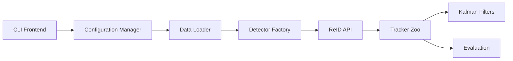

# mikel-brostrom/boxmot

> Bibliothèque et CLI de suivi multi-objets avec trackers et ReID interchangeables, pour la vision.

## Le problème
Brancher un détecteur, un modèle de ré-identification et un tracker, puis les évaluer sur MOT17, demande beaucoup de colle ad hoc.

## Ce que ça fait vraiment
Une seule CLI `boxmot` pour `track`, `eval`, `tune`, `train-reid`, `export`, etc.
Une dizaine de trackers (occluboost, botsort, bytetrack, strongsort…) avec scores HOTA/MOTA/IDF1 publiés.
Boîtes AABB et OBB, cache Parquet des détections et embeddings, backend C++ optionnel.
Une API Python : `tracker.update(dets, frame)`.

## Comment c'est branché


## Essayer
```bash
pip install boxmot
boxmot track --detector yolo26n --reid lmbn_n_duke --tracker occluboost --source 0 --save --show
```

## Coût et pièges
Gratuit ; un GPU est préférable pour la détection et la ReID. La licence AGPL-3.0 contamine tout service qui l'embarque.

## Ce que ce n'est pas
Pas un détecteur : il s'appuie sur des détecteurs externes (YOLO…). Le C++ natif est optionnel, il faut l'activer explicitement.

## Alternatives
Aucune alternative nommée dans le README.

## Pour toi
À adopter pour tout projet de tracking vidéo : le comparatif des trackers et l'évaluation intégrée font gagner des semaines, à condition d'accepter l'AGPL.
