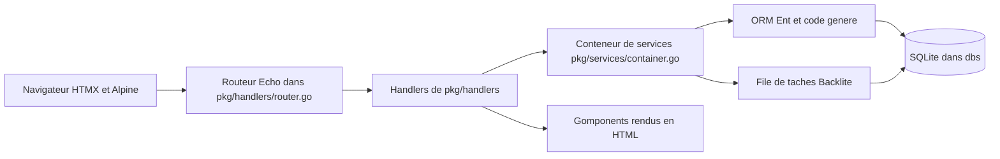

# mikestefanello/pagoda

> **A Go web application skeleton you clone**, for people who want server-rendered HTML without writing JavaScript.

## The problem

Starting a web app in Go means wiring the router, the ORM, sessions, authentication,
background queues, HTML rendering and live reloading yourself. Each piece is documented on
its own; nothing says how they fit together, and the assembly restarts from scratch on every
project. The README frames that assembly as the real cost.

## What it actually does

It is a repository to clone, not a library: the README states explicitly that you do **not**
use `go get`. It ships a service container (`pkg/services/container.go`) holding
authentication, cache, configuration, database, files, mail, ORM, tasks, validator and web,
injected into route handlers. It provides full authentication (login/logout, registration,
password reset with a bcrypt-hashed token, an admin flag on the `User` entity), an admin
panel generated from the Ent schema, task queues persisted in SQLite through Backlite, forms
with inline validation, an in-memory cache, a pager, flash messages, and a mail client that
is deliberately unfinished — the README says "You must finish the implementation of
`MailClient.send`". The UI is built in Go with Gomponents, plus HTMX, Alpine.js and DaisyUI
in the browser.

## How it is wired



`BuildRouter()` in `pkg/handlers/router.go` mounts the middleware stack and the routes; each
`Handler` self-registers its routes and receives the container through `Init()`. The
container carries the shared services. Ent generates entity code and, via a custom extension
(`ent/admin/extension.go`), the admin panel code. SQLite is both the database and the
persistent store for queued tasks, whose dispatcher is started in `cmd/web/main.go` with
`c.Tasks.Start(ctx)`.

## Trying it

```bash
git clone git@github.com:mikestefanello/pagoda.git
cd pagoda
make install
make admin email=your@email.com
make run
```

Then open `localhost:8000`. `make help` lists every target; `make watch` runs the app with
Air live reloading and `make css` rebuilds Tailwind. Data lands in the `dbs` directory, which
you delete to wipe everything.

## Cost and traps

Nothing to pay and nothing to subscribe to: you need Go installed, that is all. The traps are
elsewhere. Email sending does not exist — the client is a skeleton you finish yourself. The
session encryption key (`Config.App.EncryptionKey`) ships with a default the README calls
imperative to change in any live environment. The admin panel is labelled beta and under
active development, with a roadmap still listing sorting, filters and unsupported field types
such as JSON. Uploaded files are neither stored as entities nor served back: it is an
illustration to implement. No cron solution is provided at all. And Postgres and Redis were
dropped in favour of SQLite; the `postgres-redis` branch that held them is no longer
maintained.

## What it is not

It is not a framework, and the README says so up front: no version upgrades, no stable API,
no upstream dependency — you clone it, the code becomes yours, and so does the maintenance.
It is not a finished product either: mail, files, cron and part of the admin are starting
points. And it is not a JavaScript starter kit: the whole point is writing no JS and no CSS,
which is a structural choice rather than an option you can toggle.

## Alternatives

The README names no competing project, only the building blocks it assembles (Echo, Ent,
Gomponents, Backlite). Among the catalogue neighbours, `go-gitea/gitea` is the closest Go
application technically, but it is a finished product, not a starting point: you deploy it,
you do not strip it for parts. `ToolJet/ToolJet` answers the same "ship an internal app fast"
need from the opposite direction, low-code and hosted. The other neighbours are not
comparable.

## For you

Little direct value for data or ML work: no notebooks, no pipelines, no inference. But if you
have to ship an internal interface around a model — a form, a background job queue, an admin
over some entities — without standing up a front-end stack, this is a readable, lock-in-free
base. Watch rather than adopt: single maintainer, and the admin panel is still beta.
