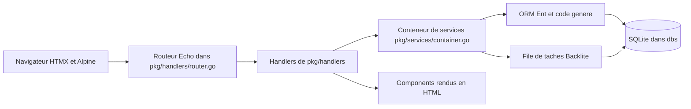

# mikestefanello/pagoda

> **Squelette d'application web Go à cloner**, pour qui veut du HTML rendu serveur sans écrire de JavaScript.

## Le problème

Démarrer une application web en Go, c'est recoller soi-même le routeur, l'ORM, les sessions,
l'authentification, les files de tâches, le rendu HTML et le rechargement à chaud. Chacun de
ces choix est documenté séparément, aucun ne dit comment les faire tenir ensemble, et on
repart de zéro à chaque projet. Le README pose ce recollage comme le vrai coût.

## Ce que ça fait vraiment

C'est un dépôt à cloner, pas une bibliothèque : le README précise explicitement qu'on
n'utilise pas `go get`. Il fournit un conteneur de services (`pkg/services/container.go`)
regroupant authentification, cache, configuration, base de données, fichiers, mail, ORM,
tâches, validateur et serveur web, injecté dans les handlers. Il livre l'authentification
complète (login/logout, inscription, mot de passe oublié avec jeton haché en bcrypt, drapeau
admin sur l'entité `User`), un panneau d'administration généré depuis le schéma Ent, des
files de tâches persistées dans SQLite via Backlite, un système de formulaires avec
validation inline, un cache en mémoire, un pager, des messages flash et un client mail —
ce dernier étant volontairement incomplet : le README écrit « You must finish the
implementation of `MailClient.send` ». L'interface se construit en Go avec Gomponents, plus
HTMX, Alpine.js et DaisyUI côté navigateur.

## Comment c'est branché



`BuildRouter()` dans `pkg/handlers/router.go` monte la pile de middlewares et les routes ;
chaque `Handler` enregistre lui-même ses routes et reçoit le conteneur via `Init()`. Le
conteneur porte les services partagés. Ent génère le code des entités — et, via une extension
maison (`ent/admin/extension.go`), le code du panneau d'admin. SQLite sert à la fois de base
de données et de magasin persistant pour les tâches, dont le dispatcher est démarré dans
`cmd/web/main.go` par `c.Tasks.Start(ctx)`.

## Essayer

```bash
git clone git@github.com:mikestefanello/pagoda.git
cd pagoda
make install
make admin email=your@email.com
make run
```

Puis `localhost:8000`. `make help` liste toutes les cibles ; `make watch` lance le
rechargement à chaud via Air, et `make css` recompile Tailwind. Les données atterrissent dans
le répertoire `dbs`, qu'il suffit de supprimer pour tout remettre à zéro.

## Coût et pièges

Rien à payer, rien à s'abonner : il faut Go installé, et c'est tout. Les pièges sont ailleurs.
L'envoi d'e-mail n'existe pas — le client est un squelette à finir soi-même. La clé de
chiffrement des sessions (`Config.App.EncryptionKey`) a une valeur par défaut que le README
qualifie d'impérative à changer en environnement réel. Le panneau d'admin est annoncé en bêta
et sous développement actif, avec une feuille de route qui liste encore les tris, les filtres
et les types de champs non supportés (JSON, par exemple). Les fichiers uploadés ne sont ni
enregistrés en base ni servis : c'est une illustration, à implémenter. Le cron n'est pas
fourni du tout. Enfin, Postgres et Redis ont été retirés au profit de SQLite ; la branche
`postgres-redis` qui les contenait n'est plus maintenue.

## Ce que ce n'est pas

Ce n'est pas un framework, et le README le dit d'entrée : pas de mises à jour de version, pas
d'API stable, pas de dépendance amont — on clone, et le code devient le sien, avec la dette
qui va avec. Ce n'est pas non plus un produit fini : mail, fichiers, cron et une partie de
l'admin sont des amorces. Et ce n'est pas un starter kit JavaScript : la promesse tient
précisément à ne pas écrire de JS ni de CSS, ce qui est un choix structurant, pas une option.

## Alternatives

Dans le README, aucun projet concurrent n'est nommé — seulement les briques qu'il assemble
(Echo, Ent, Gomponents, Backlite). Parmi les voisins du catalogue, `go-gitea/gitea` est
l'application Go la plus proche techniquement, mais c'est un produit fini, pas une base de
départ : on le déploie, on ne le cannibalise pas. `ToolJet/ToolJet` répond au même besoin
« faire une app interne vite » par une approche opposée, low-code et hébergée. Les autres
voisins ne sont pas comparables.

## Pour toi

Peu d'intérêt direct pour du data/ML : pas de notebook, pas de pipeline, pas d'inférence. En
revanche, si tu dois livrer une interface interne autour d'un modèle — formulaire, file de
jobs en arrière-plan, admin sur des entités — sans monter une stack front, c'est une base
lisible et sans lock-in. À surveiller plutôt qu'à adopter : mainteneur unique et admin en bêta.
