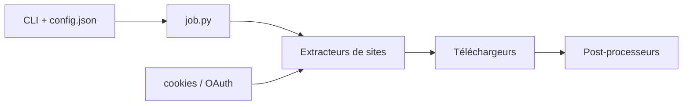

# mikf/gallery-dl

> Programme en ligne de commande qui télécharge galeries d'images et collections depuis de nombreux sites d'hébergement.

## Le problème
Récupérer en masse des images ou des collections depuis des sites qui n'offrent pas d'export demande du scraping sur mesure pour chacun.

## Ce que ça fait vraiment
Tu passes des URL ; un extracteur propre à chaque site liste les fichiers, un téléchargeur les récupère, puis des post-processeurs (métadonnées, archive, conversion) s'appliquent. Il gère identifiants, cookies (y compris depuis le navigateur) et OAuth. La configuration est en JSON, avec un nommage de fichiers flexible. Le développement actif a déménagé sur Codeberg.

## Comment c'est branché


## Essayer
```bash
python -m pip install -U gallery-dl
gallery-dl "https://danbooru.donmai.us/posts?tags=bonocho"
gallery-dl --cookies-from-browser firefox "URL"
```

## Coût et pièges
Gratuit. Les cookies de session que tu exportes donnent accès à tes comptes : à manipuler avec soin. Le respect des conditions des sites reste à ta charge.

## Ce que ce n'est pas
Ce n'est pas un outil de vidéo générale : pour HLS/DASH il s'appuie sur yt-dlp ou youtube-dl, optionnels.

## Alternatives
yt-dlp ou youtube-dl (cités comme dépendances optionnelles) pour la vidéo.

## Pour toi
À surveiller : pratique pour constituer un corpus d'images à partir de sites publics, mais vérifie droits d'usage et licence des données avant tout entraînement.

