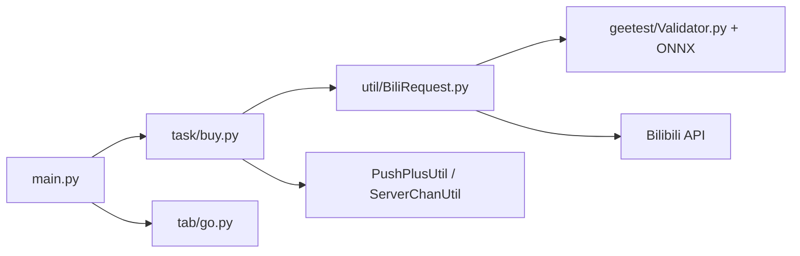

# mikumifa/biliTickerBuy

> Outil d'aide à l'achat sur la boutique de membres de Bilibili, avec résolution de captchas.

## Le problème
Obtenir des billets ou produits à vente limitée sur Bilibili demande de réagir plus vite qu'un humain et de passer un captcha Geetest.

## Ce que ça fait vraiment
Application Python : `main.py` orchestre des onglets (`tab/`) et des tâches d'achat (`task/buy.py`), appelle l'API Bilibili via un client HTTP avec gestion des cookies, résout le captcha Geetest avec des modèles ONNX, stocke l'état dans une base clé-valeur locale et envoie des notifications PushPlus ou ServerChan. Empaquetage PyInstaller et Docker.

## Comment c'est branché

## Essayer
Le README ne documente aucune commande : il renvoie à un guide d'installation et à un manuel hébergés sur Feishu. Ces liens ne sont pas dans la matière fournie.

## Coût et pièges
Gratuit, mais il faut un compte Bilibili et des cookies. Le README impose la licence PolyForm Noncommercial 1.0.0 : aucun usage commercial ni service de rachat. GitHub n'a pas identifié la licence.

## Ce que ce n'est pas
Pas un outil neutre : il contourne des captchas sur une plateforme tierce et le README demande de respecter ses règles. Le mainteneur propose de retirer le dépôt en cas de plainte de Bilibili.

## Alternatives
- biliTickerSkill : version en skill du même auteur.
- biliTickerStorm : version distribuée du même auteur.

## Pour toi
À ignorer : outil de contournement de captchas sous licence non commerciale, hors de ton profil data, IA ou MLOps et risqué juridiquement.

