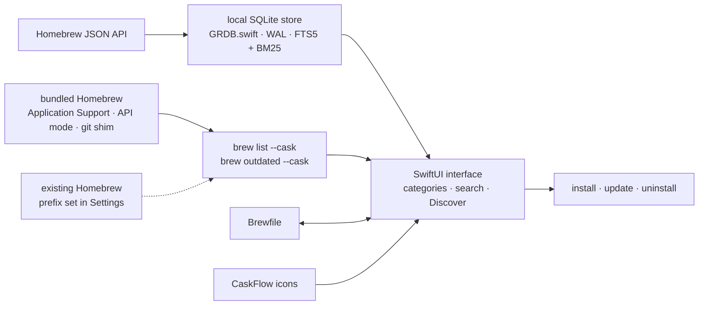

# milanvarady/Applite

> **A macOS app store for Homebrew casks, aimed at people who never open a terminal.**

## The problem

Installing a macOS app that isn't on the App Store today means opening a terminal, installing
the Xcode Command Line Tools, then Homebrew, then remembering the right `brew install --cask`
line. Every other Homebrew GUI assumes `brew` is already there, so they solve the second step
and leave the first one untouched.

## What it actually does

- Applite **ships its own Homebrew**: on first launch it downloads a Homebrew tarball into its
  own Application Support directory and runs it from there, in API mode behind a git shim. No
  Terminal, no Command Line Tools.
- It can also **reuse an existing Homebrew**: point it at any prefix in Settings.
- **Casks only, by design**: no formulae, no services, no CLI surface. Apps in categories, with
  icons and a search field.
- The catalog is a **local SQLite database** (GRDB.swift, WAL mode) synced from the Homebrew
  JSON API, with FTS5 full-text search and BM25 ranking.
- Loading is two-stage: SQLite paints the UI immediately, then `brew list --cask` and
  `brew outdated --cask` fill in installed and outdated state, so nothing blocks on the CLI.
- **Brewfile import and export** with a per-app selection sheet, casks from custom taps, system
  proxy support (HTTP, HTTPS, SOCKS5), 7 languages, no telemetry.

## How it is wired

No code-derived diagram exists for this repository; the graph below is reconstructed from the
README alone, using the components it names.



The point: SQLite and the `brew` CLI are two separate paths, and the UI never waits on the
second one.

## Trying it

The README documents three download routes; only one is a command:

```bash
brew install --cask applite
```

Otherwise [applite.app](https://applite.app) or the direct DMG from the latest release.
Universal binary, Apple Silicon and Intel.

## Cost and gotchas

- **Free, open source, MIT, no telemetry** — the README is explicit on all four. No API key, no
  account, no quota.
- **macOS 14 minimum**, a deliberate choice (`@Observable` and `NavigationSplitView` without
  back-deployment shims). Older Macs are out.
- **One more Homebrew on the machine**: if you already have one and don't point Applite at it in
  Settings, it installs a second copy under Application Support.
- **Single maintainer**, who says so: "I don't have much time for development, but I release
  updates periodically." Release cadence depends on one person.
- **AI-assisted code since 1.4**: the author states he uses Claude Code for refactoring and
  small-to-medium features, with the core written by hand beforehand. If that is a dealbreaker
  he points to Cork himself.

## What it is not

- **Not a package manager**: it is a front end over Homebrew Cask. Nothing is packaged or hosted
  here; the catalog and the binaries stay Homebrew's.
- **Not a replacement for the `brew` CLI**: casks only, so no formulae, no services, no deep tap
  management. Your command-line tools stay in the terminal.
- **Not cross-platform**: a native Swift/SwiftUI app, macOS 14+ only.

## Alternatives

| | When to prefer it |
|---|---|
| **buresdv/Cork** | Compared in the README and a catalog neighbour: formulae, casks, services and taps, for power users. Prefer it to cover all of Homebrew rather than apps alone — at 25 € prebuilt (free if self-compiled) and under a Commons Clause licence, which is not open source. Explicitly developed without AI. |
| **Homebrew/brewui** | Named in the README: Homebrew's official GUI, formulae and casks, AGPL-3.0. Prefer it eventually for upstream alignment — but the README places it in early development, with no Brewfile import/export yet. |
| **alielsokary/CaskHub** | Named in the README: same non-technical audience, casks only, MIT. Prefer it for discovery features; skip it if telemetry bothers you (Sentry + TelemetryDeck) or if the Mac is below macOS 15.6. |

The other catalog neighbours (`bysiber/cleardisk`, `jordanbaird/Ice`,
`KartikLabhshetwar/better-shot`) are unrelated macOS utilities.

## For you

This is not a data or MLOps tool; it is workstation plumbing. Useful the day you set up a new
Mac — the importable Brewfile and the bundled Homebrew save the half-day bootstrap — but if you
already type `brew install`, the gain is visual comfort only. Worth watching, not worth wiring
into a production toolchain.
