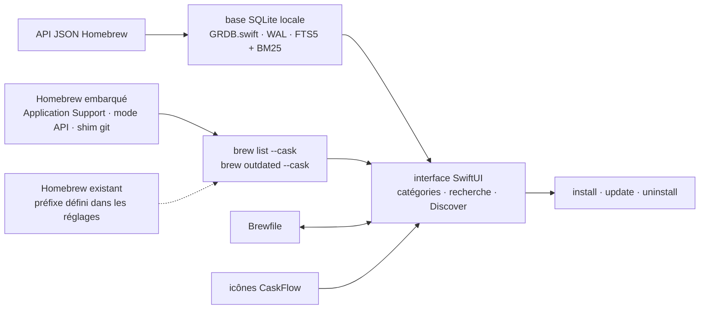

# milanvarady/Applite

> **Boutique d'applications macOS pour les casks Homebrew, destinée à qui n'ouvre pas de terminal.**

## Le problème

Installer une application macOS absente du Mac App Store suppose aujourd'hui d'ouvrir un
terminal, d'installer les Xcode Command Line Tools, puis Homebrew, puis de retenir la bonne
ligne `brew install --cask`. Les autres interfaces graphiques pour Homebrew supposent toutes
que `brew` est déjà là : elles ne règlent donc pas le premier pas, seulement le second.

## Ce que ça fait vraiment

- Applite **embarque son propre Homebrew** : au premier lancement il télécharge une archive
  Homebrew dans son répertoire Application Support et la fait tourner depuis là, en mode API
  derrière un shim git. Ni terminal ni Command Line Tools requis.
- Il peut aussi **réutiliser un Homebrew existant** : le préfixe se désigne dans les réglages.
- Il ne gère **que les casks** : pas de formulae, pas de services, pas de surface CLI. Les
  applications sont présentées en catégories, avec icônes et champ de recherche.
- Le catalogue est une **base SQLite locale** (GRDB.swift, mode WAL) synchronisée depuis l'API
  JSON de Homebrew, avec recherche plein texte FTS5 et classement BM25.
- Le chargement est en deux temps : SQLite peint l'interface immédiatement, puis
  `brew list --cask` et `brew outdated --cask` remplissent l'état installé/périmé.
- **Import et export de Brewfile** (avec feuille de sélection par application), casks issus de
  taps personnalisés, prise en charge des proxys système (HTTP, HTTPS, SOCKS5), 7 langues,
  aucune télémétrie.

## Comment c'est branché

Aucun diagramme tiré du code n'existe pour ce dépôt : ce schéma est reconstruit depuis le seul
README, à partir des composants qu'il nomme explicitement.



Le point à retenir : SQLite et le CLI `brew` sont deux chemins distincts, et l'affichage ne
bloque jamais sur le second.

## Essayer

Le README documente trois voies de téléchargement, dont une seule en ligne de commande :

```bash
brew install --cask applite
```

Sinon, le site [applite.app](https://applite.app) ou le DMG direct depuis la page des
releases. Binaire universel, Apple Silicon et Intel.

## Coût et pièges

- **Gratuit, open source, licence MIT, aucune télémétrie** — le README est explicite sur les
  quatre points. Pas de clé d'API, pas de compte à créer, pas de quota.
- **macOS 14 minimum**, par choix assumé (`@Observable` et `NavigationSplitView` sans shims de
  rétro-déploiement). Un Mac plus ancien est hors jeu.
- **Un Homebrew de plus sur la machine** : si vous en avez déjà un et que vous ne le désignez
  pas dans les réglages, l'application en installe un second dans son Application Support.
- **Mainteneur unique**, qui le dit lui-même : « I don't have much time for development, but I
  release updates periodically ». Le rythme de sortie dépend d'une personne.
- **Code assisté par IA depuis la version 1.4** : l'auteur déclare utiliser Claude Code pour
  du refactoring et des fonctionnalités petites à moyennes, le cœur ayant été écrit à la main
  avant. Si c'est rédhibitoire pour vous, il renvoie lui-même vers Cork.

## Ce que ce n'est pas

- **Ce n'est pas un gestionnaire de paquets** : c'est une façade sur Homebrew Cask. Rien n'est
  empaqueté ni hébergé ici ; le catalogue et les binaires restent ceux de Homebrew.
- **Ce n'est pas un remplaçant de `brew` en ligne de commande** : casks uniquement, donc pas de
  formulae, pas de services, pas de taps gérés en profondeur. Vos outils CLI restent au terminal.
- **Ce n'est pas multiplateforme** : application native Swift/SwiftUI, macOS 14+ seulement.

## Alternatives

| | Quand le préférer |
|---|---|
| **buresdv/Cork** | Comparé dans le README, et voisin du catalogue : formulae, casks, services et taps, pour utilisateurs avancés. À préférer si vous voulez couvrir tout Homebrew et pas seulement les applications — au prix de 25 € prébuilt (gratuit si compilé soi-même) et d'une licence Commons Clause, non libre. Développé explicitement sans IA. |
| **Homebrew/brewui** | Nommée dans le README : l'interface graphique officielle de Homebrew, formulae et casks, AGPL-3.0. À préférer à terme pour l'alignement amont — mais le README la donne en développement précoce, sans import/export de Brewfile. |
| **alielsokary/CaskHub** | Nommée dans le README : même cible non technique, casks uniquement, MIT. À préférer pour ses fonctions de découverte ; à écarter si la télémétrie gêne (Sentry + TelemetryDeck) ou si le Mac est sous macOS 15.6. |

Les autres voisins du catalogue (`bysiber/cleardisk`, `jordanbaird/Ice`,
`KartikLabhshetwar/better-shot`) sont des utilitaires macOS sans rapport avec l'installation
d'applications.

## Pour toi

Ce n'est pas un outil de data ou de MLOps : c'est de l'outillage de poste de travail. Utile le
jour où vous montez un Mac neuf — le Brewfile importable et le Homebrew embarqué évitent la
demi-journée de bootstrap — mais si vous savez déjà taper `brew install`, la valeur ajoutée se
limite au confort visuel. À surveiller, pas à intégrer à une chaîne de production.
