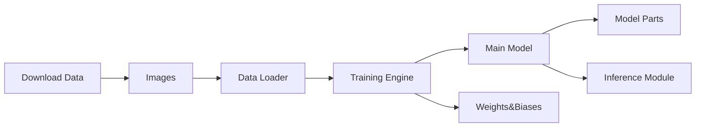

# milesial/Pytorch-UNet

> Implémentation PyTorch de U-Net pour segmentation sémantique, entraînée sur le challenge Carvana.

## Le problème
Il faut une base U-Net simple et lisible pour démarrer un projet de segmentation sans framework lourd.

## Ce que ça fait vraiment
Modèle U-Net (`unet/unet_model.py`, `unet_parts.py`), chargeur `utils/data_loading.py`, scripts `train.py`, `predict.py`, `evaluate.py`.
Précision mixte `--amp`, facteur d'échelle, suivi Weights & Biases.
Modèle pré-entraîné Carvana via `torch.hub` (échelles 0.5 et 1.0).
Image Docker prête ; Dice 0.988 annoncé sur les données de test Carvana.

## Comment c'est branché


## Essayer
```bash
pip install -r requirements.txt
bash scripts/download_data.sh
python train.py --amp
python predict.py -i image.jpg -o output.jpg
```

## Coût et pièges
GPU CUDA recommandé, compte Kaggle pour les données ; W&B crée des runs anonymes supprimés après 7 jours.
Dernier push en 2024 : dépendances à revalider.

## Ce que ce n'est pas
Pas une bibliothèque de segmentation générique : le chargeur attend `data/imgs` et `data/masks` sans sous-dossiers.
GPL-3.0 : contamine un produit distribué.

## Alternatives
Aucune alternative nommée dans le README.

## Pour toi
À ignorer en production (inactif, GPL) ; à garder comme exemple pédagogique pour expliquer U-Net.
