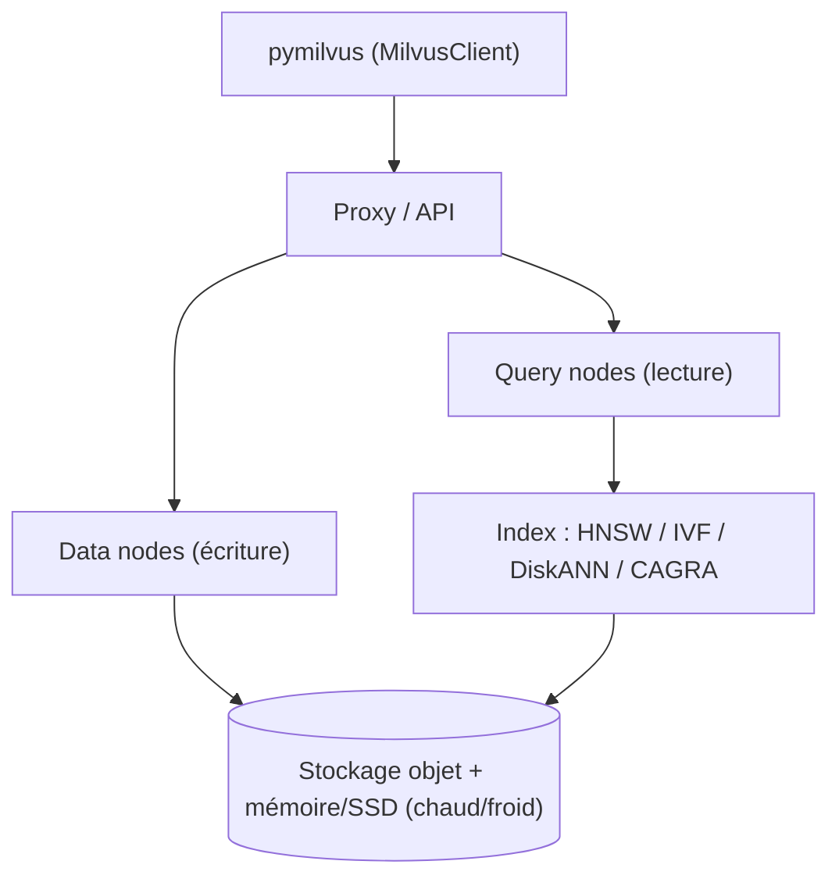

# milvus-io/milvus

> Base de données vectorielle distribuée pour recherche sémantique et RAG à grande échelle.

## Le problème
Chercher parmi des milliards de vecteurs avec filtres sur métadonnées dépasse ce qu'un index
en mémoire ou une extension SQL encaisse sans s'effondrer.

## Ce que ça fait vraiment
Stocke vecteurs et scalaires (entiers, chaînes, JSON) dans une même collection, et fait de la
recherche filtrée, par plage ou hybride. Sépare calcul et stockage : on ajoute des query nodes
pour la lecture, des data nodes pour l'écriture, sur Kubernetes.
Supporte HNSW, IVF, FLAT, SCANN, DiskANN, leurs variantes quantifiées et le mmap, plus l'indexation
GPU (CAGRA de NVIDIA). Gère BM25 et les embeddings creux appris (SPLADE, BGE-M3) à côté du dense,
le multi-tenant par base/collection/partition, et le stockage chaud/froid.

## Comment c'est branché


## Essayer
```bash
pip install -U pymilvus
# Base locale dans un fichier :
#   client = MilvusClient("milvus_demo.db")   # via pymilvus[milvus-lite]
git clone https://github.com/milvus-io/milvus.git
cd milvus/
./scripts/install_deps.sh
make
```

## Coût et pièges
Le logiciel est gratuit (Apache 2.0, LF AI & Data). Zilliz Cloud est le service managé payant du
contributeur principal. Compiler depuis les sources demande Go ≥ 1.21, CMake ≥ 3.26.4 (< 4), GCC ≥ 11
et Python ≤ 3.11. Le mode distribué suppose Kubernetes ; l'indexation GPU suppose une carte NVIDIA.

## Ce que ce n'est pas
Ce n'est pas une base relationnelle : les scalaires servent à filtrer, pas à faire des jointures.
Milvus Lite (fichier local) sert au démarrage rapide, pas à la production. Le mode Standalone
sur une machine existe mais ne donne pas la tolérance aux pannes décrite pour le distribué.

## Alternatives
Aucune base concurrente n'est nommée dans le README ; il ne cite que des intégrations
(LangChain, LlamaIndex, Attu, Milvus CDC).

## Pour toi
Le choix quand ton RAG passe du prototype au volume et que le filtrage par métadonnées compte.
