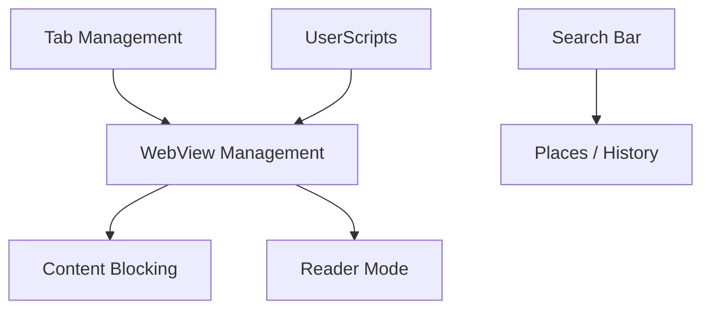

# minbrowser/min

> Navigateur minimaliste centré sur la confidentialité, avec blocage des pubs et traqueurs, pour un usage quotidien sobre.

## Le problème
Les navigateurs courants sont chargés d'options et de traqueurs qui distraient et pistent l'utilisateur.

## Ce que ça fait vraiment
Navigateur Electron avec recherche plein texte dans l'historique, blocage de publicités et traqueurs, vue lecture automatique, tâches (groupes d'onglets), étiquettes de favoris, intégration de gestionnaires de mots de passe, thème sombre, scripts utilisateur, mise à niveau HTTPS et lecteur PDF. Binaires pour Windows, macOS et Linux (deb, rpm, AUR).

## Comment c'est branché


## Essayer
```bash
sudo dpkg -i /path/to/download
npm install
npm run start
npm run buildDebian
```

## Coût et pièges
Gratuit. 605 issues ouvertes. Compiler pour macOS demande Xcode, et pour Windows Visual Studio.

## Ce que ce n'est pas
Pas un navigateur pour l'automatisation ni le scraping : il vise l'usage humain quotidien.

## Alternatives
Aucune alternative nommée dans le README.

## Pour toi
À ignorer pour le métier : simple navigateur sans usage data/IA ; à tester seulement si tu cherches un navigateur léger et privé.

