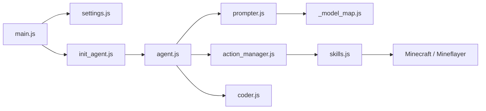

# mindcraft-bots/mindcraft

> Bots Minecraft pilotés par LLM, qui dialoguent, planifient et agissent via Mineflayer.

## Le problème
Étudier des agents incarnés demande un environnement riche ; Minecraft l'est, mais le relier à un LLM reste à faire.

## Ce que ça fait vraiment
Chaque profil JSON définit modèles (chat, code, vision, embedding, voix) et prompts d'un bot.
Le bot perçoit le monde, converse, choisit des commandes et compétences Mineflayer ; génération de code optionnelle.
Une vingtaine de fournisseurs (OpenAI, Anthropic, Ollama, vLLM…).
Mode tâches pour des épisodes reproductibles (collecte, construction) et évaluation multi-agents.

## Comment c'est branché


## Essayer
```bash
npm install
node main.js
node main.js --task_path tasks/basic/single_agent.json --task_id gather_oak_logs
docker-compose up --build
```

## Coût et pièges
Minecraft Java requis, clé API à ta charge. `allow_insecure_coding` fait exécuter du code LLM : Docker conseillé.

## Ce que ce n'est pas
Pas sûr sur un serveur public avec le code activé. Les mainteneurs disent répondre peu aux issues GitHub.

## Alternatives
Aucune alternative nommée dans le README.

## Pour toi
À ignorer sauf recherche sur les agents incarnés : banc d'essai amusant, sans lien avec un pipeline data ou MLOps.
