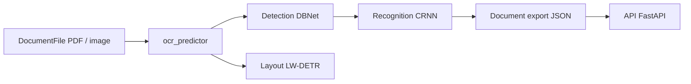

# mindee/doctr

> Bibliothèque PyTorch d'OCR de documents : détection puis reconnaissance de texte, layout et KIE.

## Le problème
Extraire proprement le texte et sa structure de PDF ou d'images scannées exige des modèles et un post-traitement pénibles à assembler.

## Ce que ça fait vraiment
`ocr_predictor` enchaîne un modèle de détection (DBNet, LinkNet, FAST) et de reconnaissance (CRNN, SAR, MASTER, ViTSTR, PARSeq…).
Lit PDF, images ou pages web ; gère les pages pivotées ; option `detect_layout` (titres, tableaux, en-têtes).
Sortie en objet `Document` hiérarchique exportable en JSON ; prédicteur KIE multi-classes.
Démo Streamlit, gabarit d'API FastAPI, images Docker GPU. Maintenu désormais par t2k GmbH.

## Comment c'est branché


## Essayer
```bash
pip install python-doctr
pip install "python-doctr[viz,html,contrib]"
streamlit run demo/app.py
python scripts/analyze.py path/to/your/doc.pdf
docker build -t doctr .
```

## Coût et pièges
Gratuit, Apache-2.0 ; Python 3.11+. GPU conseillé pour le volume (images CUDA 12.2).
L'analyse d'architecture générée ne fournit aucun composant exploitable.

## Ce que ce n'est pas
Pas un convertisseur PDF → Markdown complet avec chapitres.
Pas un modèle de langage : pas de compréhension sémantique au-delà du KIE.

## Alternatives
Aucune alternative nommée dans le README.

## Pour toi
À adopter pour l'OCR dans tes pipelines documentaires : API Python claire, modèles pré-entraînés, licence permissive.
