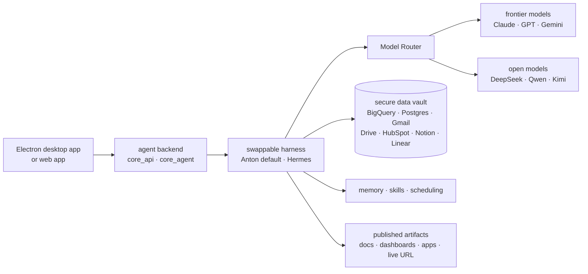

# mindsdb/mindsdb

> **An agent workspace shipped as a build-from-source superproject: app, agent backend, data vault.**

## The problem

Putting an agent to work on real company data means wiring each system yourself (BigQuery,
Postgres, Gmail, Drive, Notion and the rest), juggling one API key per model provider, and
then finding somewhere to keep memory, reusable skills and scheduled runs. Without that, every
agent stays an isolated script with no access and no continuity between sessions.

## What it actually does

First, a discrepancy worth stating: the README stored in the catalogue does **not** describe a
query engine. It describes **MindsHub** (repository `mindsdb/minds`), presented as an agent
workspace for knowledge work and software development. MCP is never mentioned, nor SQL, nor
federated data — the catalogue description and this README are about different products.

What the README does claim:

- a **secure data vault** that links third-party systems, with credentials scoped per
  connection; the README states agents never see raw keys;
- a **Model Router** to switch between frontier models (Claude, GPT, Gemini) and open models
  (DeepSeek, Qwen, Kimi) without wiring a key for each provider;
- **interchangeable open-source agent harnesses**, Anton (the default) and Hermes, swappable
  from a dropdown;
- **artifacts**: agent output becomes documents, dashboards, apps or code, publishable to a
  live URL;
- **cross-session memory, a reusable skill library and scheduled tasks**.

The repository itself is a **superproject**: it pins the `frontend`, `backend/core_api`,
`backend/core_agent` and `backend/data-vault` submodules to specific commits, so the whole
stack can be built and run from source.

## How it is wired



No code-derived diagram exists for this repository (`veille/.data/diagrammes/mindsdb__mindsdb.json`
is absent, checked). The graph above is reconstructed from the README alone; the only real
component names in it are the four submodules listed above.

## Try it

Commands copied from the README, in order:

```bash
git clone --recurse-submodules https://github.com/mindsdb/minds.git
cd minds
make setup
make dev          # or make watch: Electron desktop app with hot reload
make dev-web      # web app in the browser
make build        # production build
```

Other documented targets: `make dist-mac`, `make dist-win`, `make pack-local`, `make flush`,
and for submodule branch work `cp dev.env.example dev.env` then `make use`, `make refs`,
`make baseline`, `make pin`, `make server`/`make app`, `make server-local`/`make app-local`.

Without building: the web app at `console.mindshub.ai` (nothing to install, sign-in required),
or the `.pkg` (macOS) and `.exe` (Windows) downloads. Linux is source-build only.

## Cost and gotchas

The repository is under **MIT** — the README says so explicitly, badge and License section —
but it adds that "bundled components are governed by their own licenses — see each submodule's
repository". So the repository licence tells you nothing about the licence of the code that
actually runs; that has to be checked submodule by submodule, which the README does not do.

The model is **freemium**: "free to start", with Pro adding *all* frontier models and private
artifacts, deferred to a pricing page. In practice the free tier does not give the full model
catalogue. An account is required for the hosted app, and Python 3.10–3.13 is stated for the
build path.

Two operational traps the README names itself: `make flush` removes the local runtime, `~/.anton`
(provider keys) and `~/.cowork` (database, hermes, projects) — conversations and saved keys
included, with a confirmation prompt unless `FORCE=1`. And submodules are configured with
`ignore = all`, with pins moving only via `make pin`: a clean `git status` does not mean the
tree matches the pinned commits.

## What it is not

- **Not the query engine the catalogue describes.** No MCP server, no federated SQL layer, no
  query engine: the stored README says nothing of the sort. The catalogue entry points at a
  product this README no longer documents.
- **Not a standalone repository.** It is a superproject of pins: without `--recurse-submodules`
  there is nothing to run. The application code lives elsewhere.
- **Not a dependency-free local install.** Models go through the Model Router and the vault
  connects third-party services; the "cloud, VPC, on-prem, air-gapped and hybrid" deployment
  claim is one sentence with no procedure attached.
- **The extent of openness is not established.** The agent harnesses are called open source;
  the Model Router and the vault are not described that way.

## Alternatives

No comparable alternative in the catalogue. The README names no competing repository — only
models and providers. The suggested neighbours address other subjects: `clidey/whodb` and
`benborla/mcp-server-mysql` are database access layers (a UI, and a MySQL MCP server), while
`vitali87/code-graph-rag` and `Graphify-Labs/graphify` do graph-based RAG. None of them offers
an agent workspace with model routing, artifacts and scheduling.

## For you

Worth watching, not adopting as it stands: the gap between the catalogue description and the
README signals a renamed or redirected repository, and you should settle which of the two
products you were after before investing. For a data/AI profile the technical interest sits in
two pieces — the vault with per-connection scoped credentials, and the Model Router — more than
in the app itself. The swappable harnesses and the submodule pinning scheme are worth reading;
daily use means accepting the paid tier or building everything yourself.
