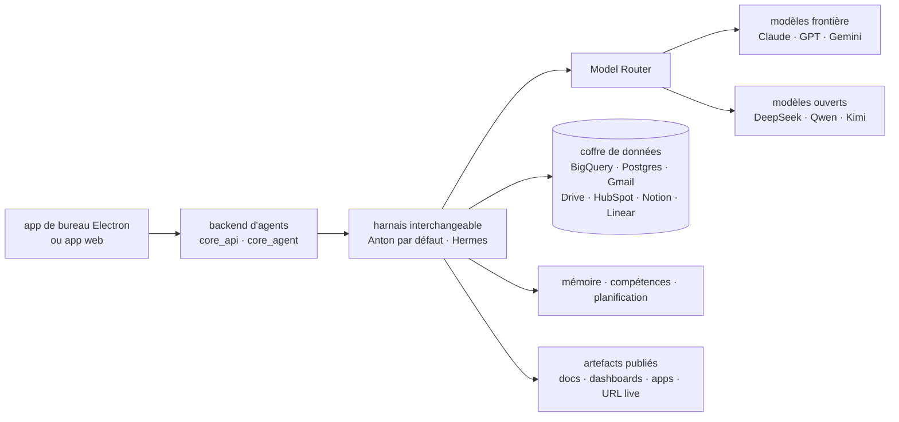

# mindsdb/mindsdb

> **Un poste de travail à agents, en superprojet à compiler : app, backend d'agents, coffre de données.**

## Le problème

Faire travailler un agent sur ses vraies données suppose de brancher soi-même chaque système
(BigQuery, Postgres, Gmail, Drive, Notion…), de gérer une clé par fournisseur de modèle, puis
de trouver où poser la mémoire, les compétences réutilisables et les tâches planifiées. Sans
cela, chaque agent reste un script isolé, sans accès et sans continuité entre sessions.

## Ce que ça fait vraiment

Attention d'entrée de jeu : le README stocké dans le catalogue ne décrit **pas** le moteur de
requêtes historique. Il décrit **MindsHub** (dépôt `mindsdb/minds`), présenté comme un
« agent workspace » pour le travail de connaissance et le développement logiciel. Le mot MCP
n'y apparaît pas, ni SQL, ni « données fédérées » : la description du catalogue et le README
ne parlent plus du même produit.

Ce que le README annonce, lui :

- un **coffre de données** (« secure vault ») qui relie des systèmes tiers, avec des
  identifiants cantonnés par connexion — le README précise que les agents ne voient jamais
  les clés brutes ;
- un **Model Router** pour basculer entre modèles propriétaires (Claude, GPT, Gemini) et
  ouverts (DeepSeek, Qwen, Kimi) sans câbler une clé par fournisseur ;
- des **harnais d'agents open source interchangeables**, Anton (par défaut) et Hermes,
  commutables depuis un menu déroulant ;
- des **artefacts** : la sortie d'un agent devient document, tableau de bord, app ou code,
  publiable sur une URL ;
- **mémoire inter-sessions, bibliothèque de compétences et exécution planifiée**.

Le dépôt lui-même est un **superproject** : il épingle par commit les sous-modules
`frontend`, `backend/core_api`, `backend/core_agent` et `backend/data-vault`, et sert à
construire la pile entière depuis les sources.

## Comment c'est branché



Aucun diagramme tiré du code n'existe pour ce dépôt (`veille/.data/diagrammes/mindsdb__mindsdb.json`
est absent, vérifié). Ce schéma est reconstruit depuis le seul README : les seuls noms de
composants réels sont les quatre sous-modules cités ci-dessus.

## Essayer

Commandes copiées du README, dans l'ordre :

```bash
git clone --recurse-submodules https://github.com/mindsdb/minds.git
cd minds
make setup
make dev          # ou make watch : app de bureau Electron, rechargement à chaud
make dev-web      # app web dans le navigateur
make build        # build de production
```

Autres cibles documentées : `make dist-mac`, `make dist-win`, `make pack-local`, `make flush`,
et pour travailler sur des branches de sous-modules `cp dev.env.example dev.env` puis
`make use`, `make refs`, `make baseline`, `make pin`, `make server`/`make app`,
`make server-local`/`make app-local`.

Sans compiler : l'app web sur `console.mindshub.ai` (rien à installer, connexion requise), ou
les binaires `.pkg` (macOS) et `.exe` (Windows). Linux n'a que la compilation.

## Coût et pièges

Le dépôt est sous **MIT** — le README le dit explicitement, badge et section *License* — mais
il ajoute que « les composants embarqués sont régis par leurs propres licences, voir le dépôt
de chaque sous-module ». La licence du dépôt ne renseigne donc pas celle du code réellement
exécuté : c'est à vérifier sous-module par sous-module, ce que le README ne fait pas.

Le modèle est **freemium** : « Free to start », et l'offre Pro ajoute *tous* les modèles
frontière et les artefacts privés, renvoyée à une page de tarifs. Concrètement, le palier
gratuit ne donne pas le catalogue de modèles complet. Il faut un compte pour l'app hébergée,
et Python 3.10–3.13 est annoncé côté build.

Deux pièges opérationnels nommés par le README : `make flush` supprime le runtime local,
`~/.anton` (clés fournisseurs) et `~/.cowork` (base, hermes, projets) — donc conversations et
clés enregistrées, avec confirmation sauf `FORCE=1`. Et les sous-modules sont en `ignore = all`,
les épinglages ne bougeant que par `make pin` : un `git status` propre ne veut pas dire que
l'arbre est aligné sur les commits épinglés.

## Ce que ce n'est pas

- **Ce n'est pas le moteur de requêtes décrit par le catalogue.** Ni serveur MCP, ni couche
  SQL fédérée, ni « query engine » : le README stocké n'en dit pas un mot. La fiche du
  catalogue pointe un produit que ce README ne documente plus.
- **Ce n'est pas un dépôt autonome.** C'est un superprojet d'épinglages : sans
  `--recurse-submodules`, il n'y a rien à exécuter. Le code applicatif vit ailleurs.
- **Ce n'est pas une installation locale sans dépendances externes.** Les modèles passent par
  le Model Router et le coffre relie des services tiers ; le déploiement « cloud, VPC,
  on-prem, air-gapped, hybride » est annoncé en une phrase, sans aucune procédure.
- **Le degré d'ouverture n'est pas établi.** Les harnais d'agents sont dits open source, le
  Model Router et le coffre ne sont pas qualifiés ainsi.

## Alternatives

Aucune alternative comparable dans le catalogue. Le README ne nomme aucun dépôt concurrent —
seulement des modèles et des fournisseurs. Et les voisins proposés relèvent d'autres sujets :
`clidey/whodb` et `benborla/mcp-server-mysql` sont des accès à des bases (interface ou serveur
MCP MySQL), `vitali87/code-graph-rag` et `Graphify-Labs/graphify` du RAG sur graphe. Aucun
n'offre un poste de travail à agents avec routage de modèles, artefacts et planification.

## Pour toi

À surveiller, pas à adopter en l'état : l'écart entre la description du catalogue et le README
signale un dépôt renommé ou redirigé, et il faut trancher lequel des deux produits on visait
avant d'y investir. L'intérêt technique pour un profil data/IA est dans deux briques — le
coffre à identifiants cantonnés par connexion et le Model Router — plus que dans l'app. Les
harnais interchangeables et le mécanisme de sous-modules valent une lecture, l'usage quotidien
suppose d'accepter le palier payant ou de tout compiler.
