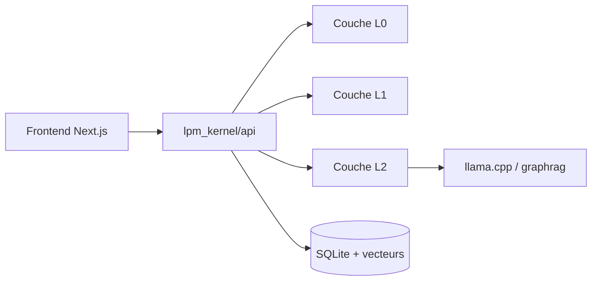

# mindverse/Second-Me

> Prototype open source pour entraîner localement un « double IA » à partir de ses propres souvenirs.

## Le problème
Les IA centralisées ne connaissent pas ton contexte et gardent tes données ; l'auteur veut une IA personnelle locale.

## Ce que ça fait vraiment
Entraînement local d'un modèle sur tes mémoires (méthodes « Hierarchical Memory Modeling » et « Me-Alignment », citées avec un article), interface web, applications de jeu de rôle et d'« AI Space », réseau décentralisé optionnel. D'après le code : frontend Next.js, noyau Python `lpm_kernel` (couches L0, L1, L2), bases SQLite et vectorielle, dépendances graphrag et llama.cpp, robot WeChat et modules MCP.

## Comment c'est branché


## Essayer
```bash
git clone https://github.com/mindverse/Second-Me.git
cd Second-Me
make docker-up
```
Puis ouvrir http://localhost:3000.

## Coût et pièges
Mémoire vive limitante : 8 Go permettent seulement des modèles d'environ 0,8 milliard de paramètres (tableau indicatif). Sous 0,5B, les résultats sont décevants (le README le dit). Dernier push en septembre 2025.

## Ce que ce n'est pas
Pas une IA « 100 % privée » garantie : le réseau décentralisé est une option, et le README annonce des cloud à explorer. Feuille de route de mai 2025 non suivie de mise à jour documentée.

## Alternatives
Aucune alternative nommée dans le README.

## Pour toi
À surveiller : intéressant pour voir un pipeline de fine-tuning personnel local, mais le matériel exigé limite vite la qualité.

