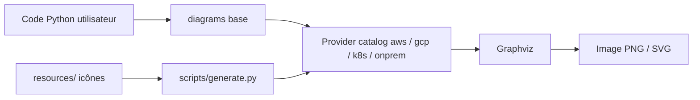

# mingrammer/diagrams

> Bibliothèque Python qui dessine des architectures cloud à partir de code, pour architectes et équipes MLOps.

## Le problème
Les schémas d'architecture faits dans un outil graphique dérivent du système réel et se versionnent mal.

## Ce que ça fait vraiment
On décrit nœuds et liens en Python ; la bibliothèque produit un graphe rendu par Graphviz. Des espaces de noms par fournisseur (AWS, Azure, GCP, Kubernetes, Oracle, Alibaba, on-premise, SaaS, programmation…) fournissent les icônes. Elle ne pilote aucune ressource cloud et ne génère ni CloudFormation ni Terraform. Un éditeur en ligne (playground) tourne dans le navigateur via Pyodide.

## Comment c'est branché


## Essayer
```bash
brew install graphviz
pip install diagrams
```

## Coût et pièges
Gratuit ; Python 3.9+ et Graphviz installé à part. Pas de clé ni de compte. Le propriétaire est un particulier : mainteneur unique probable, non précisé par le README.

## Ce que ce n'est pas
Ni un outil de découverte d'infrastructure ni un générateur de code d'infra : il dessine ce que tu décris.

## Alternatives
- go-diagrams : la version pour Go.

## Pour toi
Adopter pour documenter des architectures MLOps sous forme de code versionné dans Git, à coût nul.

