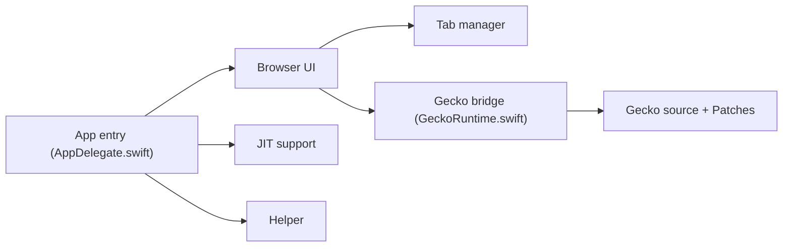

# minh-ton/reynard-browser

> Navigateur iOS basé sur Gecko plutôt que WebKit, pour anciens iPhone et curieux.

## Le problème
Sur iOS, tous les navigateurs utilisent WebKit, lié à l'OS : les iPhone non mis à jour gardent un moteur dépassé.

## Ce que ça fait vraiment
Porte le moteur Gecko sur UIKit via des correctifs (graphique, IPC, widget, JIT), avec un wrapper GeckoView pour l'interface. Prend en charge les extensions Firefox et des protections de confidentialité. Distribué en sideload (AltStore/SideStore, TrollStore, jailbreak). Le README annonce lui-même un état expérimental, bugs à prévoir.

## Comment c'est branché


## Essayer
```bash
git clone --recursive https://github.com/minh-ton/reynard-browser
cd reynard-browser
./tools/development/update-gecko.sh
./tools/development/apply-patches.sh
./tools/development/build-idevice.sh
./tools/development/build-gecko.sh
```
Puis ouvrir `Reynard.xcodeproj` dans Xcode.

## Coût et pièges
Gratuit ; construire exige Xcode, Python 3, Rust et un import de Gecko volumineux ; l'auteur ne fournit pas de support de build. LiveContainer non supporté.

## Ce que ce n'est pas
Pas un navigateur du store Apple. Pas destiné au travail data.

## Alternatives
Aucune alternative nommée dans le README (Safari et WebKit servent de comparaison).

## Pour toi
À ignorer : curiosité iOS sans utilité pour un profil data/IA/MLOps.

