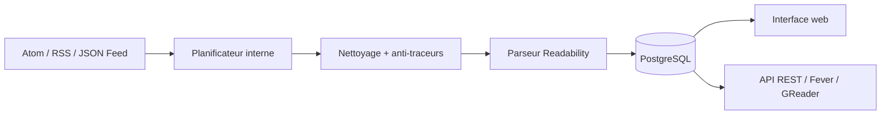

# miniflux/v2

> Lecteur de flux minimaliste en Go, binaire unique, adossé à PostgreSQL.

## Le problème
Les lecteurs de flux hébergés pistent la lecture, imposent leur interface et ferment boutique ;
les auto-hébergés traînent souvent une pile lourde à maintenir.

## Ce que ça fait vraiment
Lit Atom 0.3/1.0, RSS 1.0/2.0 et JSON Feed 1.0/1.1, importe/exporte l'OPML, gère catégories, favoris,
pièces jointes et recherche plein texte via Postgres. Retire les pixels espions, les paramètres de
suivi (`utm_*`, `fbclid`), bloque le JavaScript externe, applique une CSP et une Trusted Types Policy,
et proxifie les médias. Extrait l'article original par un parseur Readability local, avec règles de
scraping et de réécriture par sélecteurs CSS et filtres regex. Plus de 25 intégrations, API REST,
compatibilité Fever et Google Reader.

## Comment c'est branché

## Essayer
Aucune commande n'est donnée dans ce README ; il renvoie vers les instructions d'installation de la
documentation officielle, avec paquets Debian/RPM, binaires et images Docker Hub, GHCR et Quay.io.

## Coût et pièges
Gratuit, Apache 2.0. **PostgreSQL obligatoire** : aucune autre base n'est supportée. HTTPS automatique
via Let's Encrypt, ou certificats fournis. Navigateurs modernes seulement.

## Ce que ce n'est pas
Pas un agrégateur intelligent : pas de recommandation, pas de résumé, pas d'IA.
Pas modulable à l'infini — le projet est revendiqué comme « opinionated », avec une section dédiée
à ce choix dans la documentation. Piloté essentiellement par un auteur unique.

## Alternatives
Aucun dépôt alternatif n'est nommé dans le README.

## Pour toi
Le socle propre si tu veux industrialiser une veille sans confier tes lectures à un service tiers.
