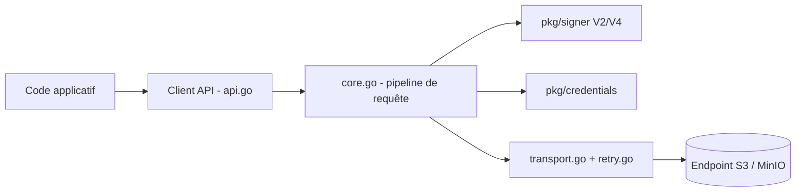

# minio/minio-go

> SDK Go pour parler à tout stockage objet compatible Amazon S3, à destination des développeurs Go.

## Le problème
Parler à un stockage objet S3 à la main, c'est signer chaque requête HTTP, gérer les envois multipart et les erreurs propres à S3.

## Ce que ça fait vraiment
Le paquet racine expose les opérations de buckets et d'objets (put, get, stat, copy, remove, presigned, politiques, cycle de vie, chiffrement, réplication). Chaque appel construit une requête, la signe (Signature V2 ou V4), l'envoie via un transport avec reprises, puis décode la réponse. Les fournisseurs d'identifiants (statique, variables d'environnement, fichiers, STS) vivent dans `pkg/credentials`. Quelques extensions propres à MinIO existent (notifications, RDMA).

## Comment c'est branché


## Essayer
```bash
go get github.com/minio/minio-go/v7
go mod init example/FileUploader
go get github.com/minio/minio-go/v7/pkg/credentials
go run FileUploader.go
mc ls play/testbucket
```

## Coût et pièges
Gratuit, mais il faut un endpoint S3 (le serveur public `play.min.io` de l'exemple est ouvert à tous : toute donnée y est publique). Les clés d'accès de l'exemple sont publiques, ne jamais les réutiliser.

## Ce que ce n'est pas
Ce n'est pas un serveur MinIO, seulement un client. Ce n'est pas un outil en ligne de commande (le README s'appuie sur `mc` pour vérifier). Il ne fonctionne qu'en Go.

## Alternatives
Aucune alternative nommée dans le README ; `mc` est cité seulement comme outil de vérification.

## Pour toi
À surveiller : utile seulement si tu écris du Go qui lit ou écrit dans du stockage objet, sinon rien à en tirer côté data Python.

