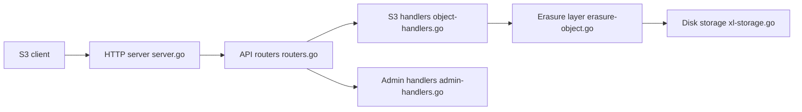

# minio/minio

> Serveur de stockage objet compatible S3, auto-hébergé ; dépôt communautaire désormais archivé.

## Le problème
Disposer d'un stockage S3 local ou on-premise pour datasets et artefacts sans dépendre d'AWS.

## Ce que ça fait vraiment
Serveur Go exposant l'API S3 : buckets, objets, codage d'effacement sur disques locaux.
Console web intégrée, IAM, politiques de bucket, cycle de vie, réplication, tiering, notifications, S3 Select, métriques.
Distribué en source uniquement : plus de binaires communautaires à jour.
**Dépôt archivé, plus maintenu** ; l'éditeur renvoie vers AIStor Free / Enterprise.

## Comment c'est branché


## Essayer
```bash
go install github.com/minio/minio@latest
minio server PATH
mc alias set local http://localhost:9000 minioadmin minioadmin
mc admin info local
```

## Coût et pièges
Go ≥ 1.24 pour compiler ; identifiants par défaut `minioadmin:minioadmin` à changer. AGPL-3.0 : obligations à valider pour tout usage.

## Ce que ce n'est pas
Plus un projet vivant : aucun correctif de sécurité à attendre. Les binaires historiques ne sont plus mis à jour. Prod sur build source « à vos risques ».

## Alternatives
- AIStor Free / AIStor Enterprise : successeurs cités par l'éditeur (pas des dépôts GitHub nommés).

## Pour toi
Ne plus démarrer de projet dessus ; planifier la migration des stacks MLOps qui l'utilisent.
