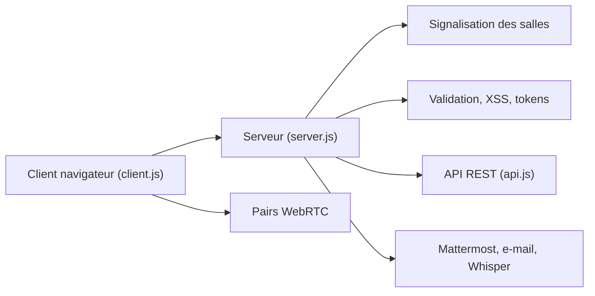

# miroslavpejic85/mirotalk

> Visioconférence WebRTC pair à pair auto-hébergée, avec chat, tableau blanc et API REST.

## Le problème
Les services de visio imposent des limites de durée, des forfaits et un traitement des données par un tiers.

## Ce que ça fait vraiment
Un serveur Node fournit la signalisation des salles ; les navigateurs établissent la communication WebRTC en pair à pair. Fonctions : jusqu'à 8K à 60 ips annoncés, partage d'écran, enregistrement, chat Markdown, tableau blanc, partage de fichiers, intégration ChatGPT, reconnaissance vocale, OIDC, JWT, mots de passe de salle, API REST, Slack/Mattermost, 133 langues.

## Comment c'est branché


## Essayer
```bash
git clone https://github.com/miroslavpejic85/mirotalk.git
cd mirotalk
cp .env.template .env
cp app/src/config.template.js app/src/config.js
npm install
npm start
```

## Coût et pièges
Gratuit, un serveur à héberger ; Docker Compose possible. Licence AGPL-3.0 : les modifications servies en réseau doivent être publiées, sinon licence commerciale payante (CodeCanyon). Le README contient de nombreuses mentions de sponsors.

## Ce que ce n'est pas
En pair à pair pur, la qualité chute avec le nombre de participants ; le README ne précise pas de limite. Pas un outil data/IA : l'IA se limite à une intégration ChatGPT.

## Alternatives
Non documenté dans le README : aucune alternative nommée (comparaison générique avec « autres solutions »).

## Pour toi
Hors de ton périmètre data/IA : à ignorer, sauf besoin précis de visio auto-hébergée, avec la contrainte AGPL en tête.

