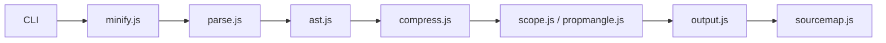

# mishoo/UglifyJS

> Parseur, compresseur, « mangleur » et embellisseur JavaScript, en bibliothèque et en ligne de commande.

## Le problème
Du JavaScript livré tel quel est lourd : noms longs, espaces, code mort.

## Ce que ça fait vraiment
Parse le source en AST, applique optionnellement compression et renommage des variables ou propriétés, puis régénère du JavaScript et une source map. La fonction `minify()` enchaîne ces étapes. Accepte aussi un AST SpiderMonkey en entrée. Le mode « mangle sans compress » est 3 à 5 fois plus rapide selon le README.

## Comment c'est branché


## Essayer
```bash
npm install uglify-js -g
uglifyjs file.js -c -m -o file.min.js
uglifyjs file.js -m
uglifyjs example.js -c -m --mangle-props
```

## Coût et pièges
Gratuit. `--mangle-props` peut casser le code (avertissement du README) et le compresseur fait des hypothèses listées longuement (pas de `arguments.callee`, etc.).

## Ce que ce n'est pas
Ce n'est pas un transpileur : pour les syntaxes exotiques, le README renvoie à Babel avant Uglify. Dernier push en novembre 2024.

## Alternatives
- Babel : à passer en amont pour les syntaxes non gérées.
- Acorn : parseur utilisable via `-p acorn`.

## Pour toi
À ignorer : outil de build JavaScript, sans lien avec un flux data/IA, et peu actif depuis fin 2024.

