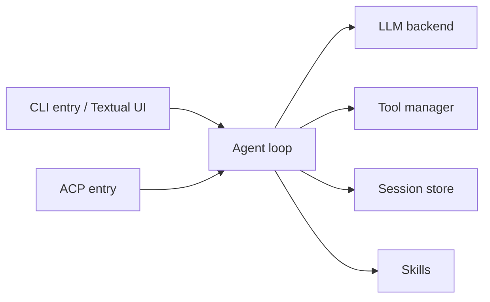

# mistralai/mistral-vibe

> Assistant de codage en ligne de commande de Mistral, avec outils, sous-agents, skills et MCP.

## Le problème
Explorer et modifier un code par le langage naturel depuis le terminal, avec des modèles Mistral.

## Ce que ça fait vraiment
Boucle d'agent avec outils `read`, `write_file`, `edit`, `bash`, `grep`, `todo`, `task` (sous-agents) et `ask_user_question`. Profils `ask`, `plan`, `accept-edits` et `auto-approve`. Skills au format Agent Skills, serveurs MCP, hooks avant/après outil, reprise de sessions, worktrees git, mode programmatique avec plafonds de coût. Point d'entrée ACP pour les éditeurs.

## Comment c'est branché


## Essayer
```bash
curl -LsSf https://mistral.ai/vibe/install.sh | bash
uv tool install mistral-vibe
vibe
```

## Coût et pièges
Clé Mistral requise, coût à ta charge (`--max-price` pour plafonner). Télémétrie active par défaut ; `enable_telemetry = false` la coupe. Le mode programmatique approuve tout sans restrictions d'outils. Unix visé, Windows toléré.

## Ce que ce n'est pas
Pas indépendant du fournisseur au sens strict : optimisé pour Mistral, même si d'autres fournisseurs sont configurables. Voix expérimentale.

## Alternatives
Le README ne nomme aucune alternative.

## Pour toi
À surveiller : correct si tu veux un agent de codage européen, mais la télémétrie et le risque de l'auto-approbation demandent de la vigilance.
