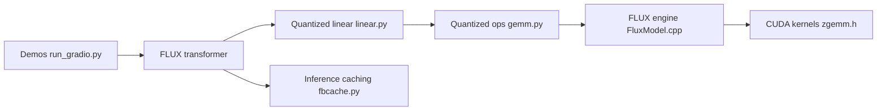

# mit-han-lab/nunchaku

> Moteur d'inférence 4 bits (SVDQuant) pour modèles de diffusion type FLUX, destiné aux utilisateurs de GPU modestes.

## Le problème
Un modèle comme FLUX.1-dev (12 B) en BF16 sature la mémoire d'un GPU grand public et force l'offload CPU, très lent.

## Ce que ça fait vraiment
Implémente SVDQuant, une quantification post-entraînement 4 bits poids+activations qui absorbe les valeurs aberrantes dans des composantes de faible rang. Le README chiffre 3,6× moins de mémoire sur FLUX.1-dev et 8,7× de gain face au BF16 sur un 4090 portable 16 Go (sans offload). Le code mêle couches Python (transformers, LoRA, cache, PuLID) et un cœur C++/CUDA.

## Comment c'est branché

## Essayer
Le README ne donne pas de commande directe : il renvoie au guide d'installation, au tutoriel d'usage, au plugin ComfyUI-nunchaku et à DeepCompressor pour quantifier ses propres modèles. Commande non documentée dans le README.

## Coût et pièges
GPU NVIDIA nécessaire (kernels CUDA). Les modèles quantifiés doivent être disponibles pour ton modèle cible ; quantifier le sien passe par DeepCompressor.

## Ce que ce n'est pas
Pas un serveur d'inférence généraliste ni un moteur pour LLM : orienté génération d'images. Les chiffres de vitesse viennent des auteurs, mesurés sur leur matériel.

## Alternatives
- DeepCompressor : la bibliothèque de quantification sous-jacente.
- QServe (même équipe) : pour le service de LLM quantifiés.

## Pour toi
À surveiller si tu fais tourner FLUX/PixArt sur GPU 16 Go : le gain mémoire est réel selon les auteurs, mais l'install passe par des docs externes et dépend de CUDA.

