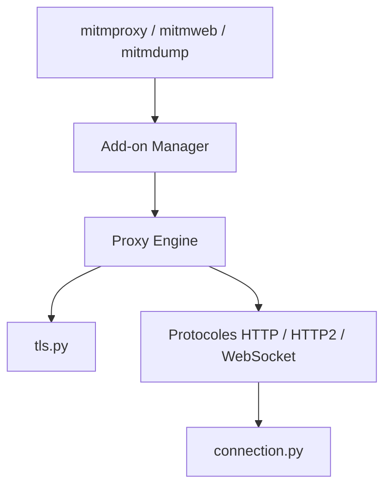

# mitmproxy/mitmproxy

> Proxy interceptant HTTP/1, HTTP/2 et WebSocket, pour inspecter et modifier le trafic, destiné aux développeurs et testeurs.

## Le problème
Comprendre ce qu'une application échange réellement avec ses serveurs (clients d'API, applis mobiles, appels à un modèle) est difficile sans voir le trafic.

## Ce que ça fait vraiment
- Trois interfaces : `mitmproxy` (console), `mitmdump` (ligne de commande, « tcpdump pour HTTP »), `mitmweb` (web).
- Interception compatible SSL/TLS.
- Un système d'add-ons et de scripts pour observer ou modifier les flux.
- Support de plusieurs modes de proxy, de HTTP/2 et de WebSocket.

## Comment c'est branché

## Essayer
Le README ne contient aucune commande : il renvoie au site du projet pour l'installation et à CONTRIBUTING.md pour l'installation depuis les sources.

## Coût et pièges
Gratuit. Le déchiffrement TLS suppose d'installer un certificat d'autorité sur l'appareil observé ; détail non documenté dans le README. Ne l'utiliser que sur son propre trafic ou avec autorisation.

## Ce que ce n'est pas
Ce n'est pas un outil d'analyse de paquets bas niveau ni un pare-feu. Interposer un proxy sur le trafic d'autrui sans consentement est illégal dans de nombreux pays.

## Alternatives
Aucune alternative nommée dans le README.

## Pour toi
À adopter : pratique pour déboguer les appels HTTP d'un pipeline, d'un agent ou d'une API de modèle, avec un script Python en add-on ; licence MIT et projet ancien et actif.

