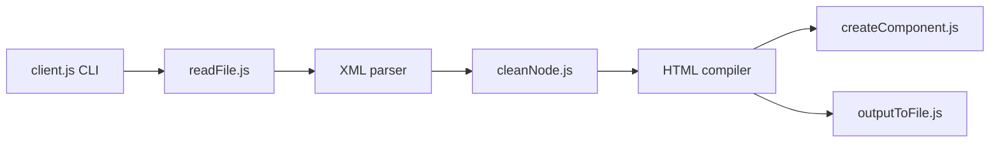

# mjmlio/mjml

> Langage de balisage qui compile en HTML d'e-mail responsive, créé par Mailjet.

## Le problème
Écrire à la main un HTML d'e-mail compatible avec tous les clients de messagerie est pénible et fragile.

## Ce que ça fait vraiment
On écrit des balises sémantiques (`mj-section`, `mj-column`, `mj-text`…) ; le moteur les analyse, valide, rend les composants et sort le HTML responsive. Utilisable en CLI (fichier, stdin, surveillance, beautify/minify), en Node (`mjml2html`) ou dans le navigateur (`mjml-browser`). Composants personnalisés via `.mjmlconfig` ; `mj-include` désactivé par défaut. Éditeur en ligne et API gratuite mentionnés.

## Comment c'est branché


## Essayer
```bash
npm install mjml
mjml input.mjml -o output.html
```

## Coût et pièges
Gratuit. Le dépôt demande yarn pour le développement. Options de sécurité autour des includes et du CSS à régler si les gabarits viennent de tiers.

## Ce que ce n'est pas
Pas un service d'envoi : il ne produit que le HTML.

## Alternatives
Aucune alternative nommée dans le README.

## Pour toi
Pertinent pour des alertes ou rapports par e-mail issus d'un pipeline ; sinon sans intérêt.

