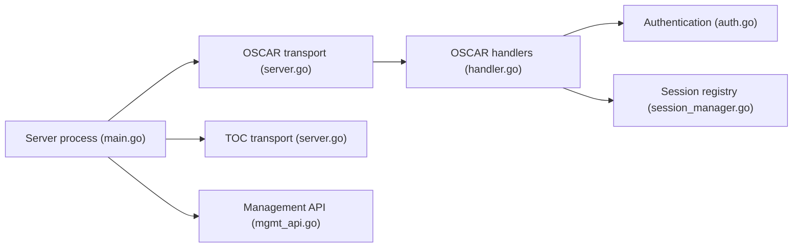

# mk6i/open-oscar-server

> Serveur de messagerie instantanée en Go compatible avec les anciens clients AIM et ICQ, pour nostalgiques et rétro-informaticiens.

## Le problème
Les clients AIM et ICQ d'époque n'ont plus de serveur officiel auquel se connecter.

## Ce que ça fait vraiment
- Gère messages, listes de contacts, salons, profils, messages d'absence, confidentialité, recherche d'annuaire, partage de fichiers.
- Clients Windows AIM 1.x à 7.x, ICQ 98 à 5, clients TOC1 et TOC2.
- API de gestion HTTP (port 8080) : utilisateurs, sessions, salons publics.
- Projet indépendant, non affilié à AOL ou Yahoo.

## Comment c'est branché


## Essayer
```bash
curl http://localhost:8080/user
curl -d'{"screen_name":"MyScreenName", "password":"thepassword"}' http://localhost:8080/user
curl http://localhost:8080/session
```
L'installation passe par des guides Linux, macOS et Windows non détaillés dans le README.

## Coût et pièges
Gratuit. L'API de gestion n'a pas d'authentification documentée dans le README : ne pas l'exposer sur un réseau ouvert.

## Ce que ce n'est pas
Pas une messagerie moderne ni chiffrée : un serveur pour les anciens clients AIM et ICQ.

## Alternatives
Aucune alternative nommée dans le README.

## Pour toi
À ignorer : projet rétro sans lien avec data/IA/MLOps.

