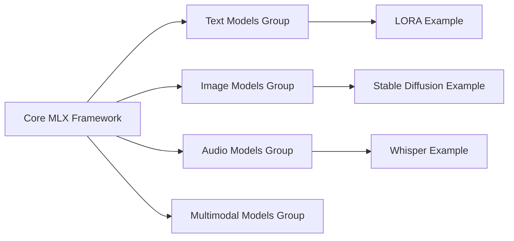

# ml-explore/mlx-examples

> Recueil d'exemples autonomes d'Apple pour entraîner et exécuter des modèles avec MLX sur Apple silicon.

## Le problème
Découvrir MLX demande des exemples concrets pour chaque famille de modèles, faute de quoi on repart de PyTorch par réflexe.

## Ce que ça fait vraiment
Un dossier autonome par exemple : Transformer LM, LLaMA/Mistral/Mixtral, LoRA et QLoRA, T5, BERT, FLUX, Stable Diffusion/SDXL, ResNet CIFAR-10, CVAE, Wan2.1 vidéo, Whisper, EnCodec, MusicGen, CLIP, LLaVA, SAM, GCN, Real NVP. Chaque dossier a son README et ses dépendances. Point d'entrée recommandé : MNIST. Poids convertis sur l'organisation Hugging Face `mlx-community`.

## Comment c'est branché

## Essayer
Aucune commande documentée dans le README racine : chaque exemple a ses instructions dans son dossier.

## Coût et pièges
Gratuit ; suppose un Mac Apple silicon pour profiter de MLX. Les dépendances varient d'un exemple à l'autre.

## Ce que ce n'est pas
Pas une bibliothèque installable ni une API stable : des exemples indépendants. Pour les LLM, le README renvoie lui-même vers MLX LM.

## Alternatives
- ml-explore/mlx-lm : paquet Python plus complet pour les LLM avec MLX.

## Pour toi
À surveiller si tu travailles sur Mac : bon catalogue pour prototyper en local (LoRA, Whisper, SD), mais pour les LLM préfère mlx-lm, que le README recommande.
