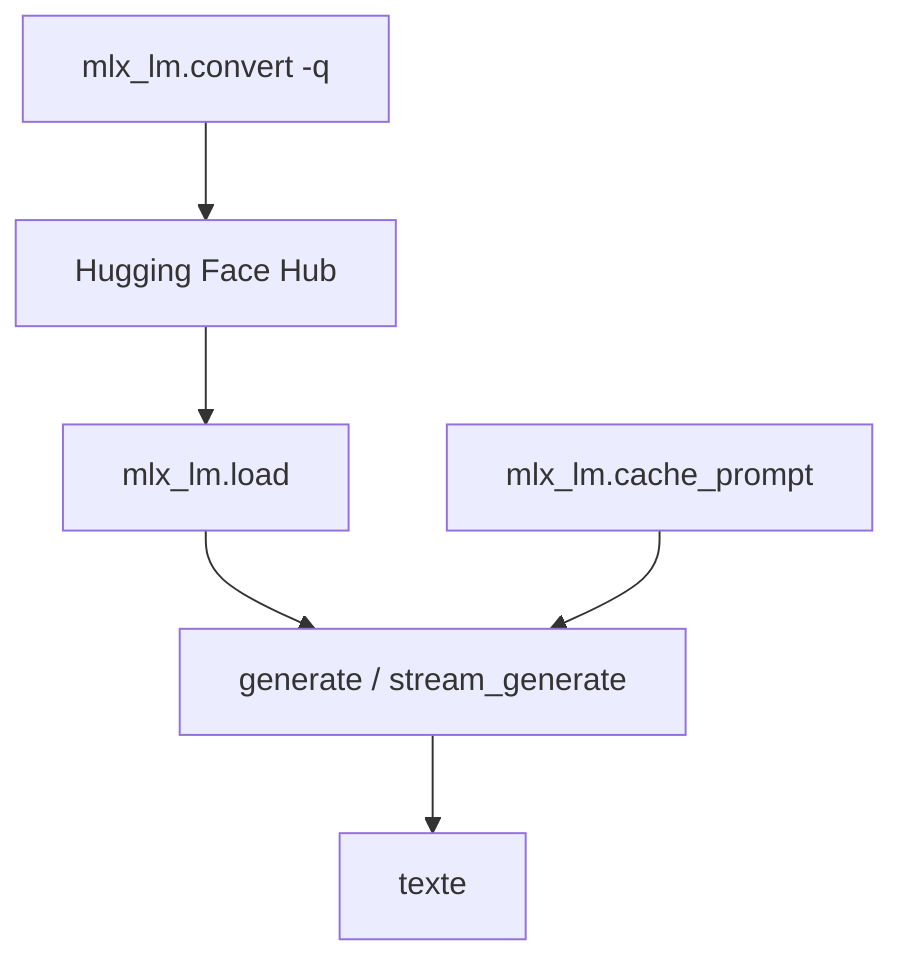

# ml-explore/mlx-lm

> Paquet Python pour générer du texte et fine-tuner des LLM sur puce Apple avec MLX.

## Le problème
Faire tourner et fine-tuner des LLM localement sur Mac Apple Silicon manque d'outils simples ; les stacks CUDA n'y tournent pas et les alternatives sont éparses.

## Ce que ça fait vraiment
Intégration Hugging Face Hub : un LLM en une commande. Quantification et upload de modèles vers le Hub. Fine-tuning LoRA et full, y compris sur modèles quantifiés. Inférence et fine-tuning distribués via `mx.distributed`. API Python (`load`, `generate`, `stream_generate`), CLI (`mlx_lm.generate`, `mlx_lm.chat`, `mlx_lm.convert`), cache de prompt, KV-cache rotatif pour longs contextes.

## Comment c'est branché


## Essayer
```sh
pip install mlx-lm
```
```bash
mlx_lm.generate --prompt "How tall is Mt Everest?"
```

## Coût et pièges
Gratuit. Puce Apple requise. Les gros modèles peuvent être lents ; `sudo sysctl iogpu.wired_limit_mb=N` (macOS 15+) aide. RAM le facteur limitant.

## Ce que ce n'est pas
Pas multiplateforme : c'est du Apple Silicon uniquement. Pas un serveur clé en main (bien qu'un `mlx_lm.server` existe).

## Alternatives
Non nommées dans le README.

## Pour toi
Excellent si tu travailles sur Mac Apple Silicon pour prototyper, quantifier et fine-tuner des LLM en local — à adopter dans ce cas.
