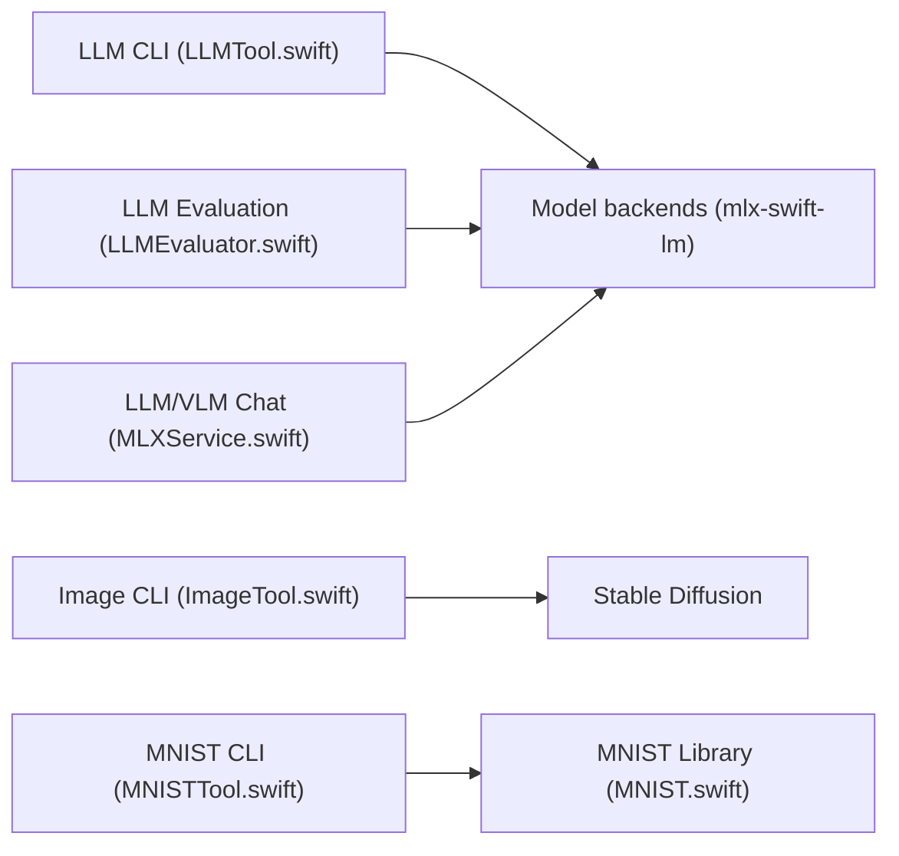

# ml-explore/mlx-swift-examples

> Exemples d'apps et d'outils MLX Swift (LLM, diffusion, MNIST) pour développeurs Apple.

## Le problème
Savoir comment faire tourner des modèles sur Apple Silicon depuis Swift, sur iOS et macOS.

## Ce que ça fait vraiment
Collection d'exemples : MNISTTrainer, LLMBasic, LLMEval, MLXChatExample (LLM et VLM), LoRATrainingExample, StableDiffusionExample, outils en ligne de commande `llm-tool`, `image-tool`, `mnist-tool`, et démos numériques (CurveFit, HeatTransfer, Mandelbrot avec noyau Metal). Les bibliothèques LLM/VLM/embedders ont migré vers le dépôt mlx-swift-lm ; restent StableDiffusion et MLXMNIST.

## Comment c'est branché


## Essayer
```bash
./mlx-run llm-tool --prompt "swift programming language"
```

## Coût et pièges
Gratuit ; Xcode et un Mac nécessaires. Les modèles se téléchargent depuis Hugging Face à l'exécution.

## Ce que ce n'est pas
Pas un produit : ce sont des exemples. Les bibliothèques de modèles ont déménagé vers mlx-swift-lm.

## Alternatives
- mlx-swift-lm : nouveau dépôt des bibliothèques LLM/VLM réutilisables.

## Pour toi
À surveiller : référence utile si tu vises du ML embarqué sur Apple, sans intérêt pour un MLOps hors écosystème Apple.

