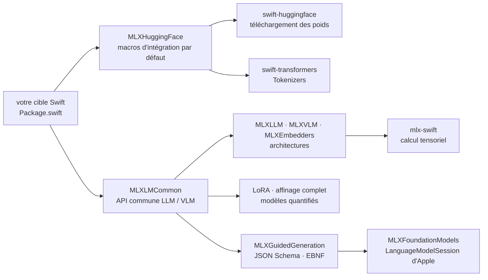

# ml-explore/mlx-swift-lm

> **Swift package for loading, fine-tuning and running LLMs and VLMs locally on Apple hardware.**

## The problem

Running a language model inside a Swift application means writing weight loading, an
architecture registry, tokenization and a generation loop yourself, then wiring all of it to
some model downloader. Without that layer, `mlx-swift` only gives you tensor operations: the
"language model" part is left to build.

## What it actually does

- **Loads models** by conforming to protocols from several tokenizer and downloader packages;
  the README offers three integration routes trading freedom against convenience.
- **Ships architecture implementations** for LLMs (`MLXLLM`) and VLMs (`MLXVLM`), plus encoders
  and embedding models (`MLXEmbedders`), behind a shared API in `MLXLMCommon`.
- **Fine-tunes**: low-rank (LoRA) and full model fine-tuning, including quantized models.
- **Constrains generation**: `MLXGuidedGeneration` forces any MLX model's output to follow a
  grammar — JSON Schema or EBNF.
- **Bridges to Apple's `FoundationModels`**: `MLXFoundationModels` exposes an MLX model as an
  `MLXLanguageModel` usable by `LanguageModelSession`, with `.vision`, `.toolCalling`,
  `.reasoning` and `.guidedGeneration` capabilities. Requires the macOS/iOS/visionOS 27.0 SDK.
- Sample applications are **not** here; they live in the separate `mlx-swift-examples` repo.

## How it is wired

No code-derived diagram exists for this repository. The sketch below only restates modules and
dependencies named in the README.



The default path goes through the `MLXHuggingFace` macros, which wire up the Hugging Face
downloader and tokenizer at once; other paths (custom downloaders, local-only weights) are
deferred to the `using` documentation.

## Trying it

The README gives no terminal command: installation means declaring dependencies in
`Package.swift`, then building with Swift Package Manager.

```bash
# Le README ne documente aucune commande d'installation ; il donne ce fragment
# de Package.swift, à recopier tel quel, puis à compiler (swift build / Xcode) :
#
#   .package(url: "https://github.com/ml-explore/mlx-swift-lm", .upToNextMajor(from: "3.31.3")),
#   .package(url: "https://github.com/huggingface/swift-huggingface", from: "0.9.0"),
#   .package(url: "https://github.com/huggingface/swift-transformers", from: "1.3.0"),
#
# Puis, côté code, le démarrage le plus court du README :
#
#   let model = try await #huggingFaceLoadModelContainer(
#       configuration: LLMRegistry.gemma3_1B_qat_4bit)
#   let session = ChatSession(model)
#   print(try await session.respond(to: "What are two things to see in San Francisco?"))
```

## Cost and gotchas

- **The package is free and local**: no API key, no metered calls. The cost is hardware —
  weights are held in memory, and the README quantifies neither RAM nor supported model sizes.
  Its example is a 4-bit quantized Gemma 3 1B, the small end of the range.
- **De facto Hugging Face dependency**: the default route (`MLXHuggingFace`,
  `swift-huggingface`) pulls weights from the Hub. Local-only weights are possible but deferred
  to another documentation page.
- **Deliberate breaking changes**: `main` is a new major version, 3.x, which decoupled the
  tokenizer and downloader packages at the price of breaking APIs. An upgrade document is
  linked.
- **The `FoundationModels` bridge needs the macOS/iOS/visionOS 27.0 SDK**, so a very recent
  toolchain.
- **Enforced formatting**: CI pins `swift-format` at `603.0.0`; contributions formatted with
  another version will not match.

## What it is not

- **Not an application or inference server**: nothing to launch, no HTTP endpoint. It is a
  package to import; the demo apps live in `mlx-swift-examples`.
- **Not a source of models**: the repo holds architecture implementations and a registry, not
  weights, which are downloaded elsewhere.
- **Not usable outside Apple's ecosystem**: everything rests on Swift, `mlx-swift` and, for the
  bridge, Apple SDKs. No Python API is documented here.

## Alternatives

| | When to prefer it |
|---|---|
| **huggingface/transformers** | Prefer it whenever the target is Python: incomparably broader architecture coverage and a full training and deployment ecosystem. `mlx-swift-lm` only earns its place when the calling code is Swift and inference runs locally on Apple hardware. |
| **ml-explore/mlx-swift-examples** | Named in the README: take it first if you want ready-made apps and tools rather than a library to integrate. |
| **huggingface/swift-transformers** | Named in the README as the tokenizer dependency. Enough on its own if you only need tokenizers in Swift, without model loading or generation. |

The other neighbours in this batch (666ghj/MiroFish,
labmlai/annotated_deep_learning_paper_implementations, ultralytics/yolov5) are not comparable:
an application, an annotated teaching collection of implementations, and an object detection
model respectively — none provides an LLM runtime layer in Swift.

## For you

Watch it rather than adopt it, unless you ship an Apple application that must generate locally:
then it is the most direct route, and the `FoundationModels` bridge plus schema-constrained
generation make it a serious base. For data science or MLOps work done in Python, this repo
changes nothing in your stack; it matters mainly as evidence of what the MLX stack makes
possible on-device.
