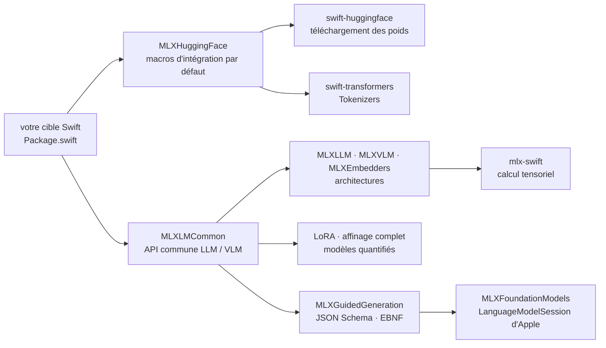

# ml-explore/mlx-swift-lm

> **Paquet Swift pour charger, affiner et faire générer des LLM et VLM en local sur du matériel Apple.**

## Le problème

Faire tourner un modèle de langage dans une application Swift oblige à réécrire soi-même le
chargement des poids, le registre des architectures, la tokenisation et la boucle de génération,
puis à rebrancher tout cela sur un téléchargeur de modèles. Sans cette couche, `mlx-swift` ne
donne que les opérations tensorielles : la partie « modèle de langage » reste à construire.

## Ce que ça fait vraiment

- **Charge des modèles** en s'intégrant, par conformité de protocole, à plusieurs paquets de
  tokenisation et de téléchargement ; le README propose trois voies d'intégration selon
  l'arbitrage voulu entre liberté et confort.
- **Fournit des implémentations d'architectures** pour les LLM (`MLXLLM`) et les VLM
  (`MLXVLM`), plus des encodeurs et modèles d'embedding (`MLXEmbedders`), avec une API commune
  dans `MLXLMCommon`.
- **Affine les modèles** : LoRA (rang faible) et affinage complet, y compris sur modèles
  quantifiés.
- **Contraint la génération** : `MLXGuidedGeneration` force la sortie de n'importe quel modèle
  MLX à respecter une grammaire — JSON Schema ou EBNF.
- **Fait le pont avec `FoundationModels` d'Apple** : `MLXFoundationModels` expose un modèle MLX
  comme un `MLXLanguageModel` utilisable par `LanguageModelSession`, avec les capacités
  `.vision`, `.toolCalling`, `.reasoning` et `.guidedGeneration`. Requiert le SDK
  macOS/iOS/visionOS 27.0.
- Les applications de démonstration ne sont **pas** ici : elles vivent dans le dépôt séparé
  `mlx-swift-examples`.

## Comment c'est branché

Aucun diagramme tiré du code n'est disponible pour ce dépôt. Le schéma reconstruit ci-dessous ne
reprend que les modules et dépendances nommés dans le README.



Le chemin par défaut passe par les macros `MLXHuggingFace`, qui branchent d'un coup le
téléchargeur et le tokenizer Hugging Face ; les autres voies (téléchargeur maison, poids locaux)
sont renvoyées à la documentation `using`.

## Essayer

Le README ne donne aucune commande de terminal : l'installation se fait en déclarant les
dépendances dans `Package.swift`, puis en compilant avec Swift Package Manager.

```bash
# Le README ne documente aucune commande d'installation ; il donne ce fragment
# de Package.swift, à recopier tel quel, puis à compiler (swift build / Xcode) :
#
#   .package(url: "https://github.com/ml-explore/mlx-swift-lm", .upToNextMajor(from: "3.31.3")),
#   .package(url: "https://github.com/huggingface/swift-huggingface", from: "0.9.0"),
#   .package(url: "https://github.com/huggingface/swift-transformers", from: "1.3.0"),
#
# Puis, côté code, le démarrage le plus court du README :
#
#   let model = try await #huggingFaceLoadModelContainer(
#       configuration: LLMRegistry.gemma3_1B_qat_4bit)
#   let session = ChatSession(model)
#   print(try await session.respond(to: "What are two things to see in San Francisco?"))
```

## Coût et pièges

- **Le paquet est gratuit et local** : aucune clé d'API, aucun appel facturé. Le coût est
  matériel — les poids sont chargés en mémoire, et le README ne chiffre ni la RAM ni la taille
  des modèles supportés. L'exemple retenu est un Gemma 3 1B quantifié en 4 bits, c'est-à-dire le
  bas de la gamme.
- **Dépendance de fait à Hugging Face** : la voie par défaut (`MLXHuggingFace`,
  `swift-huggingface`) télécharge les poids depuis le Hub. Les poids locaux sont possibles mais
  renvoyés à une autre page de documentation.
- **Rupture de compatibilité assumée** : la branche `main` est une version majeure 3.x, qui a
  découplé les paquets de tokenisation et de téléchargement au prix de changements cassants. Le
  README renvoie à un document de migration.
- **Le pont `FoundationModels` exige le SDK macOS/iOS/visionOS 27.0**, donc une chaîne d'outils
  très récente, indisponible sur des postes non mis à jour.
- **Formatage imposé** : la CI épingle `swift-format` en `603.0.0` ; une contribution non
  formatée avec cette version est rejetée.

## Ce que ce n'est pas

- **Ce n'est pas une application ni un serveur d'inférence** : rien à lancer, rien à interroger
  en HTTP. C'est un paquet à importer ; les applications d'exemple sont dans le dépôt distinct
  `mlx-swift-examples`.
- **Ce n'est pas un fournisseur de modèles** : le dépôt contient des implémentations
  d'architectures et un registre, pas les poids, qu'il faut télécharger ailleurs.
- **Ce n'est pas utilisable hors de l'écosystème Apple** : tout repose sur Swift, sur
  `mlx-swift` et, pour le pont `FoundationModels`, sur des SDK Apple. Aucune API Python n'est
  documentée ici.

## Alternatives

| | Quand le préférer |
|---|---|
| **huggingface/transformers** | À préférer dès que la cible est Python : couverture d'architectures sans commune mesure, écosystème d'entraînement et de déploiement complet. `mlx-swift-lm` ne se justifie que si le code appelant est en Swift et l'exécution locale sur matériel Apple. |
| **ml-explore/mlx-swift-examples** | Nommé dans le README : à prendre d'abord si on cherche des applications et outils déjà écrits plutôt qu'une bibliothèque à intégrer. |
| **huggingface/swift-transformers** | Nommé dans le README comme dépendance de tokenisation. Suffit seul si le besoin se limite aux tokenizers en Swift, sans chargement ni génération de modèle. |

Les autres voisins du lot (666ghj/MiroFish, labmlai/annotated_deep_learning_paper_implementations,
ultralytics/yolov5) ne sont pas comparables : ce sont respectivement une application, un recueil
pédagogique d'implémentations annotées et un modèle de détection d'objets — aucun n'offre de
couche d'exécution de LLM en Swift.

## Pour toi

À surveiller, pas à adopter, sauf si tu livres une application Apple qui doit générer en local :
c'est alors la voie la plus directe, et le pont `FoundationModels` plus la génération contrainte
par schéma en font un socle sérieux. Pour un travail de data science ou de MLOps mené en Python,
ce dépôt ne change rien à ta chaîne : il t'intéresse surtout comme démonstration de ce que la
pile MLX rend possible côté embarqué.
